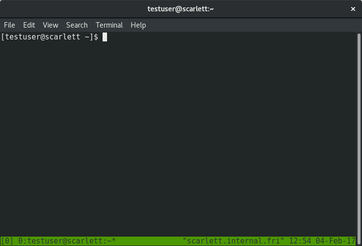
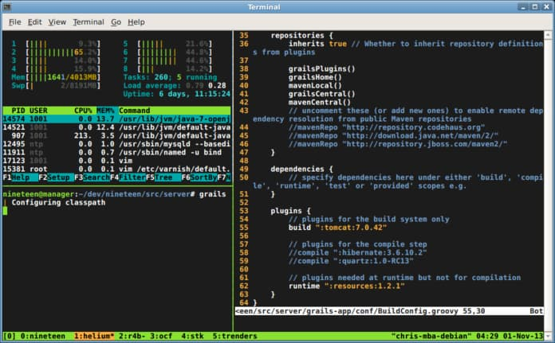

tmux => 进入窗口



`ctrl+d / 输入exit` ==> 退出窗口

Tmux 窗口有大量的快捷键。所有快捷键都要通过前缀键唤起。默认的前缀键是`Ctrl+b`，即先按下`Ctrl+b`，快捷键才会生效。


举例来说，帮助命令的快捷键是`Ctrl+b ?`。它的用法是，在 Tmux 窗口中，先按下`Ctrl+b`，再按下`?`，就会显示帮助信息。

然后，按下 ESC 键或`q`键，就可以退出帮助。


## 会话（session）管理

1. 建立会话

   > 第一个启动的 Tmux 窗口，编号是`0`，第二个窗口的编号是`1`，以此类推。这些窗口对应的会话，就是 0 号会话、1 号会话。
   >
   > better choice: `tmux new -s <session-name>` 新建一个指定名称的会话

2. 接入会话

   > `tmux attach `接入某个已经存在的会话
   >
   > ```bash
   > tmux attach -t 0
   > tmux attach -t session-name
   > ```

3. 分离会话

   > 在 Tmux 窗口中，按下`Ctrl+b d`或者输入`tmux detach`命令，就会将当前会话与窗口分离。 ==> **退出了当前的tmux窗口，但是会话里面的进程仍在后台运行**

   > `tmux ls` 查看当前所有的tmux会话

4. 杀死会话

   > `tmux kill-session -t`杀死某个会话
   >
   > ```bash
   > tmux kill-session -t 0
   > tmux kill-session -t session-name
   > ```

5. 切换会话

   > `tmux switch` 命令用于切换会话
   >
   > ```bash
   > tmux switch -t 0
   > tmux switch -t session-name
   > ```

6. 重命名会话

   > `tmux rename-session`命令用于重命名会话。
   >
   > ```bash
   > tmux rename-session -t 0 <new-name>
   > ```


## 会话快捷键

下面是一些会话相关的快捷键。

> - `Ctrl+b d`：分离当前会话。
> - `Ctrl+b s`：列出所有会话。
> - `Ctrl+b $`：重命名当前会话。

****


## 最简操作流程

综上所述，以下是 Tmux 的最简操作流程。

> 1. 新建会话`tmux new -s my_session`。
> 2. 在 Tmux 窗口运行所需的程序。
> 3. 按下快捷键`Ctrl+b d`将会话分离。
> 4. 下次使用时，重新连接到会话`tmux attach-session -t my_session`。


## 窗格操作

Tmux 可以将窗口分成多个窗格（pane），每个窗格运行不同的命令。以下命令都是在 Tmux 窗口中执行。

### 划分窗格

`tmux split-window`命令用来划分窗格。

> ```bash
> # 划分上下两个窗格
> $ tmux split-window
> 
> # 划分左右两个窗格
> $ tmux split-window -h
> ```



### 移动光标

`tmux select-pane`命令用来移动光标位置。

> ```bash
> # 光标切换到上方窗格
> $ tmux select-pane -U
> 
> # 光标切换到下方窗格
> $ tmux select-pane -D
> 
> # 光标切换到左边窗格
> $ tmux select-pane -L
> 
> # 光标切换到右边窗格
> $ tmux select-pane -R
> ```

### 交换窗格位置

`tmux swap-pane`命令用来交换窗格位置。

> ```bash
> # 当前窗格上移
> $ tmux swap-pane -U
> 
> # 当前窗格下移
> $ tmux swap-pane -D
> ```

###  窗格快捷键

下面是一些窗格操作的快捷键。

> - `Ctrl+b %`：划分左右两个窗格。
> - `Ctrl+b "`：划分上下两个窗格。
> - `Ctrl+b <arrow key>`：光标切换到其他窗格。`<arrow key>`是指向要切换到的窗格的方向键，比如切换到下方窗格，就按方向键`↓`。
> - `Ctrl+b ;`：光标切换到上一个窗格。
> - `Ctrl+b o`：光标切换到下一个窗格。
> - `Ctrl+b {`：当前窗格与上一个窗格交换位置。
> - `Ctrl+b }`：当前窗格与下一个窗格交换位置。
> - `Ctrl+b Ctrl+o`：所有窗格向前移动一个位置，第一个窗格变成最后一个窗格。
> - `Ctrl+b Alt+o`：所有窗格向后移动一个位置，最后一个窗格变成第一个窗格。
> - `Ctrl+b x`：关闭当前窗格。
> - `Ctrl+b !`：将当前窗格拆分为一个独立窗口。
> - `Ctrl+b z`：当前窗格全屏显示，再使用一次会变回原来大小。
> - `Ctrl+b Ctrl+<arrow key>`：按箭头方向调整窗格大小。
> - `Ctrl+b q`：显示窗格编号。

## 窗口管理

除了将一个窗口划分成多个窗格，Tmux 也允许新建多个窗口。

###  新建窗口

`tmux new-window`命令用来创建新窗口。

> ```bash
> $ tmux new-window
> 
> # 新建一个指定名称的窗口
> $ tmux new-window -n <window-name>
> ```

###  切换窗口

`tmux select-window`命令用来切换窗口。

> ```bash
> # 切换到指定编号的窗口
> $ tmux select-window -t <window-number>
> 
> # 切换到指定名称的窗口
> $ tmux select-window -t <window-name>
> ```

###  重命名窗口

`tmux rename-window`命令用于为当前窗口起名（或重命名）。

> ```bash
> $ tmux rename-window <new-name>
> ```

### 窗口快捷键

下面是一些窗口操作的快捷键。

> - `Ctrl+b c`：创建一个新窗口，状态栏会显示多个窗口的信息。
> - `Ctrl+b p`：切换到上一个窗口（按照状态栏上的顺序）。
> - `Ctrl+b n`：切换到下一个窗口。
> - `Ctrl+b <number>`：切换到指定编号的窗口，其中的`<number>`是状态栏上的窗口编号。
> - `Ctrl+b w`：从列表中选择窗口。
> - `Ctrl+b ,`：窗口重命名。

## 其他命令

下面是一些其他命令。

> ```bash
> # 列出所有快捷键，及其对应的 Tmux 命令
> $ tmux list-keys
> 
> # 列出所有 Tmux 命令及其参数
> $ tmux list-commands
> 
> # 列出当前所有 Tmux 会话的信息
> $ tmux info
> 
> # 重新加载当前的 Tmux 配置
> $ tmux source-file ~/.tmux.conf
> ```