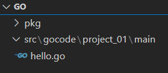
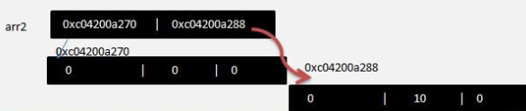
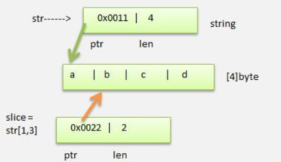
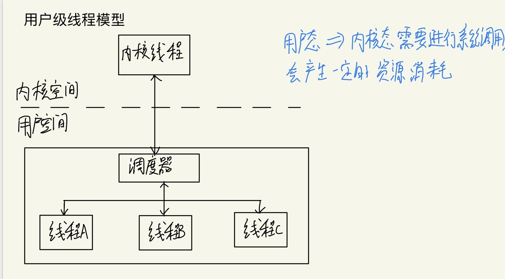
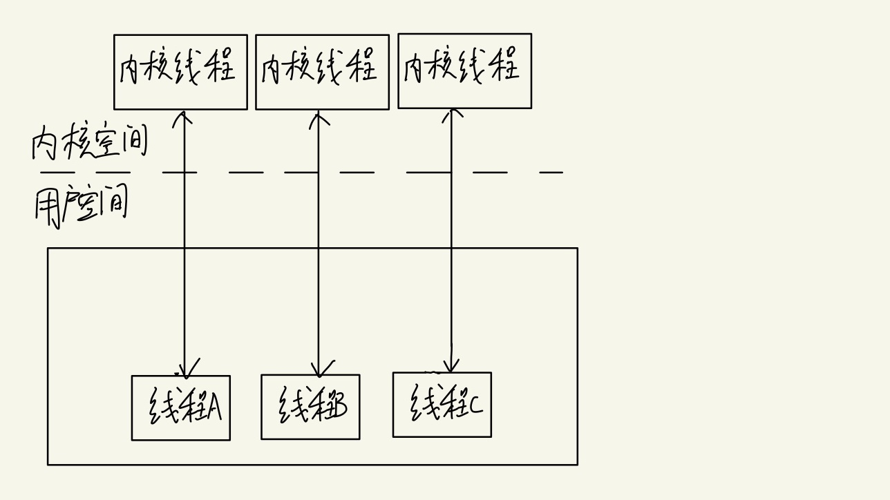
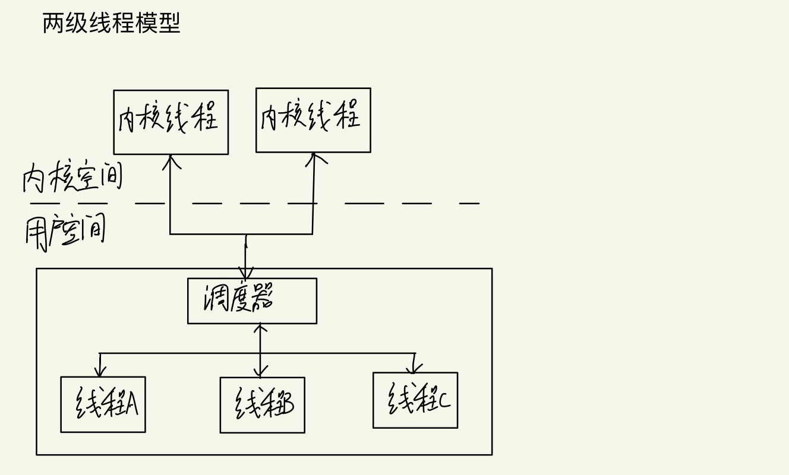
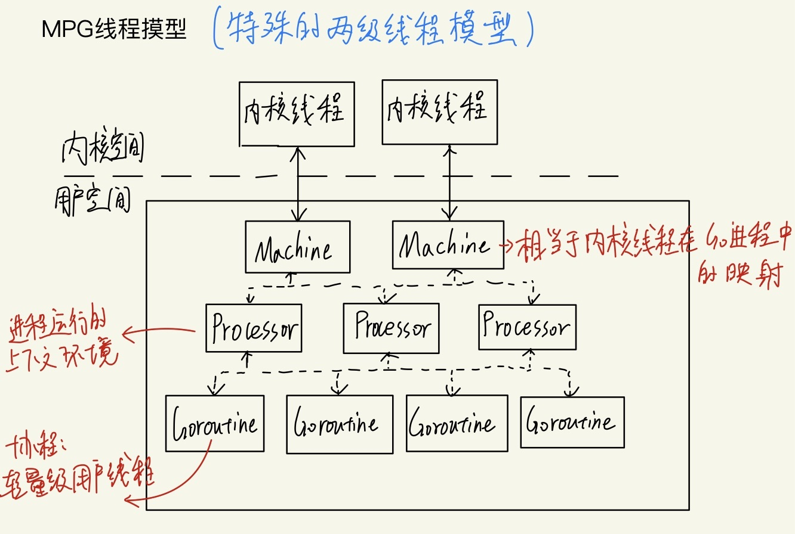
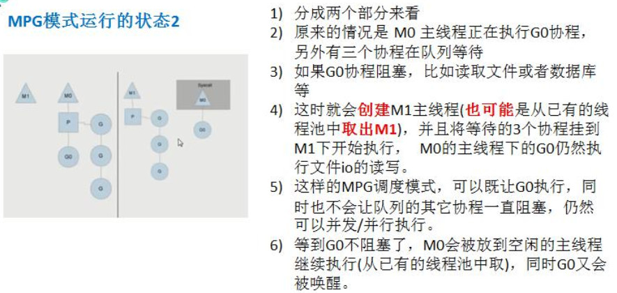

Go语言出现原因：

随着系统复杂度越来越高，维护的成本越来越高，目前的编程语言有着风格不统一、计算能力不够、处理大并发不够好的特点，因此`缺乏一个足够简洁高效`的编程语言。

- 比如Go语言为了风格统一，有着许多的要求，比如一个包中的变量、方法如果是希望被外部使用的，则要求必须首字母大写；还比如for循环{}的{必须和判断条件一行

  ```go
  for i := 0;i < 10;i++{//必须要求一行
      
  }
  ```

同样的，计算机的硬件技术更新频繁，性能提升很快，主流的编程语言发展明显落后于硬件，不能够合理的利用多核多CPU的优势来提升软件性能。

Go语言特点：

- Go语言是静态类型语言，有着静态编译语言的安全和性能，但同时，又达到了动态语言开发维护的高效率。
- 引入了包的概念，用于组织程序结构，`Go语言的一个文件都要归属于一个包`，不能单独存在。
- 垃圾回收机制，内存自动回收(防止了C、C++中的内存泄露)
- 天然并发！
  - 语言层面支持
  - goroutine轻量级前程，可实现大并发处理，高效利用多核
  - 基于CSP并发模型实现
- 吸收了管道通信机制，形成Go语言特有的管道channel，通过channel可实现不同的goroute
- 函数可以返回多个值
- 其他创新：切片slice(动态数组)、defer延时函数(方便及时回收资源)

Go语言环境配置：https://blog.csdn.net/qq_42642142/article/details/120186822

开发项目时Go程序目录结构：

当前目录：F:\Go

- src
  - gocode
    - project_01 `项目1`
      - main  `一个文件夹对应一个包`
        - hello.go `Go文件`
      - other_package `其他的包[是个文件夹]` 
    - project_02`项目1`
      - main
      - other_package

如图所示：



编写hello.go文件如下：

```go
package main

import "fmt"

func main()  {
	fmt.Println("hello")
}
```

对.go文件进行编译和执行

> 编译：go build xxx.go
>
> 也可以直接go run xxx.go，可是在实际工程中，肯定要先编译，再执行。


Golang执行流程分析：

- .go文件  ---go build编译--> 可执行文件  ---运行--> 结果
- .go文件  ---go run---> 结果

> 再编译时，编译器会将程序依赖的库文件包含在可执行文件中，所有会导致可执行文件变大了。

两种方式的区别：

1. 如果先编译生成了可执行文件，那么我们可以将该可执行文件拷贝到没有go开发环境的机器上，仍然可以运行。
2. 如果我们直接`go run`源代码，那么如果要在另外一台机器上这样运行，那么也需要go开发环境，否则无法执行。

其他注意事项：

1. 源文件以.go为扩展名
2. Go程序执行入口为main()函数
3. 区分严格大小写
4. 一行最长不超过80个字符，超过的请使用换行展示。
5. Go设计者思想：一个问题尽量只有一个解决方法


# 数组

数组定义：

`var 数组名 [数组大小]数据类型`

初始化方式：

```go
var nums [3]int  = [3]int{1,2,3}
var nums  = [3]int{1,2,3}
var nums = [...]int{4,5,6}
```

1. 数组的地址可以通过数组名来获取 &intArr
2. 数组第一个元素的地址就是数组的首地址

```go
func main(){
	var IntArr [3]int
	IntArr[0] = 1
	IntArr[0] = 31
	IntArr[0] = 6
	fmt.Println(IntArr)
	fmt.Printf("%p\n",&IntArr)
	fmt.Println(&IntArr[0])
}
```

> [6 0 0]
> addr:0xc00000c1e0
> 0xc00000c1e0

遍历方式：

1. 常规方式

   ```go
   var IntArr [3]int = [3]int{4,5,6}
   for i := 0;i < len(IntArr);i++{
       fmt.Println(IntArr[i])
   }
   ```

2. for-range结构遍历

   ```go
   for i,val := range IntArr{ //i 和 val都是仅再for循环内部可见的局部变量
       fmt.Println(i,val)
   }
   ```

数组使用注意事项:

- 一个数组一旦声明了，长度是固定的，不能动态变化
- 数组属性类型，默认是值类型


多维数组使用方式

1. 先声明/定义，在赋值

   ```go
   func main(){
   	var arr2 [2][3]int
   	arr2[1][1] = 12
   	arr2[0][1] = 13
   	fmt.Println(arr2)
   	fmt.Printf("arr[0]地址:%p\n",&arr2[0])
   	fmt.Printf("arr[1]地址:%p\n",&arr2[1])
   
   	fmt.Printf("arr[0][0]地址:%p\n",&arr2[0][0])
   	fmt.Printf("arr[1][0]地址:%p\n",&arr2[1][0])
   }
   ```

   > [[0 13 0] [0 12 0]]
   > arr[0]地址:0xc0000103f0
   > arr[1]地址:0xc000010408
   > arr[0][0]地址:0xc0000103f0
   > arr[1][0]地址:0xc000010408

   内存分布情况：

   

2. 直接初始化

   ```go
   var arr1 [2][3]int = [2][3]int{{1,2,3},{4,5,6}}
   var	arr2 [2][3]int = [...][3]int{{1,2,3},{4,5,6}} 
   var arr3 = [2][3]int{{1,2,3},{4,5,6}}
   var	arr4 = [...][3]int{{1,2,3},{4,5,6},{2,4,6}} 
   ```

二维数组的遍历：

```GO
func main(){
	var	arr = [...][3]int{{1,2,3},{4,5,6},{2,4,6}} 
	fmt.Println(arr)
	for i,v := range arr{
		for j,v2 := range v{
			fmt.Printf("arr[%v][%v]=[%v] \t",i,j,v2)
		}
		fmt.Println()
	}
}
```


# 切片

注意事项：

1. slice是一个引用类型

2. 从底层来说，切片是一个结构体

   ```go
   type slice struct{
       ptr *[2]int
       len int
       cap int
   }
   ```

切片的使用：

1. 利用一个已经创建好的数组来创建切片

   ```go
   var IntArr [3]int = [3]int{4,5,6}
   var sl = IntArr[:]  //var slice = arr[startindex:endindex](不含endindex的元素)
   for _,val := range sl{
       fmt.Println(val)
   }
   ```

2. 通过make来创建切片

   ```go
   var sl2 []float64 = make([]float64,5,10)
   sl2[0] = 10
   sl2[3] = 90
   fmt.Println(sl2)
   ```

   - 通过make方式可以指定切片的大小和容量
   - 如果没有给切片元素赋值，默认值为0
   - 通过make创建的切片对应的数组是由make底层维护的，对外不可见

3. 直接定义一个切片

   ```go
   var sl3 []string = []string{"ajs","asdu","asdhas"}
   for _,val := range sl3{
       fmt.Println(val)
   }
   ```

切片使用注意事项：

1. 切片可以继续切片

2. 使用append内置函数可以对切片进行动态追加

   ```go
   var sl2 []float64 = make([]float64,5,10)
   sl2[0] = 10
   sl2[3] = 90
   var sl3 []float64 = []float64{23,4,234,3}
   sl3 = append(sl3,123,34)
   fmt.Println(sl3)
   sl3 = append(sl3,sl2...)
   fmt.Println(sl3)
   ```

3. 可以使用copy对切片进行拷贝，新生成的切片和原来的切片数据空间是独立的，相互不影响。


string和slice

Go语言的string底层其实是一个byte类型的数组，因此string也可以进行切片处理

string和切片在内存的形式：



```go
func main(){
	var str string = "abcd"
	mslice := str[1:]
	fmt.Println(mslice)
	fmt.Printf("%T",mslice)
}
```

> bcd
> string

我们需要注意string是不可变的，也就是不能通过`str[0]= 'a'`来修改字符串，那么就不能修改了吗？可以，不过需要将其转化为[]byte或者[]rune，然后再转写成string

```go
func main(){
	var str string = "abcd"
	bytearr := []byte(str)
	bytearr[0] = 'z'
	str = string(bytearr)
	fmt.Println(str)

	runearr := []rune(str)
	runearr[0] = '哈'
	str = string(runearr)
	fmt.Println(str)
}
```

> zbcd
> 哈bcd

这里有一个小细节，我们转[]byte后，不可以处理中文，因为[]byte是按着字节来处理，而一个汉字是3个字节，此时需要用[]rune


# Map

基本语法：

`var map 变量名 map[keytype][valuetype]`

注意：声明不会分配内存，初始化需要make，分配内存后才能赋值和使用

注意事项：

- map在使用前一定要make
- map的key不能重复，如果重复了，以最后一个为准
- map的key-value是无序的
- make内置函数数目


使用方式：

```go
func main(){
	//方式1
	var a map[string]int 
	a = make(map[string]int,10)
	a["ywh"] = 21
	a["wl"] = 22
	fmt.Println(a)
	//方式2
	cites := make(map[string]string)
	cites["beijing"] = "0123"
	cites["shanghai"] = "34828"
	fmt.Println(cites)
	//方式3
	b := map[string]string{
		"a":"ywh",
		"b":"wl",
	}
	fmt.Println(b)
}
```

map的增删改查

增改：

`map[key] = value` ，如果key还没有就是增加，如果有就是修改

删除：

`delete(map,key)`，删除map中键为key的key-value

`Mmap = make(map[string][string])`，如果想直接全部删除，可以之间定义一个心新的map，让原来的成为垃圾，被GC回收

查找：

```go
if val,ok := mmap["ywh"];ok{
	//...
}else{
	//...
}
```

map的遍历：

```go
for k,v := range cites{
    fmt.Printf("k=%v,val=%v",k,v)
}
```

map也可以作为切片的数据类型：

```go
func main(){
	fruits := make([]map[string]string,2)
	if fruits[0]==nil{
		fruits[0] = make(map[string]string, 2)
		fruits[0]["name"] = "apple"
		fruits[0]["color"] = "red"
	}

	if fruits[1]==nil{
		fruits[1] = make(map[string]string, 2)
		fruits[1]["name"] = "banana"
		fruits[1]["color"] = "yellow"
	}

	fruit := map[string]string{
		"name" : "watermalon",
		"color" : "red and green",
	}

	fruits = append(fruits,fruit)

	fmt.Println(fruits)
}
```


# 函数

```GO
func 函数名（形参列表）（返回值列表）{
	执行语句
    return 返回值列表
}
```

栈区：Go语言的栈区一般存储基本数据类型，编译器存在一个逃逸分析

堆区：Go语言的堆区一般存储引用数据类型，编译器存在一个逃逸分析

没有基础的童鞋可能会比较迷惑什么是逃逸分析？首先，你需要知道什么是内存逃逸。

内存逃逸：

在C、C++中，常常会忘记分配完内存后忘记释放，从而导致内存泄露，大量的内存泄露对程序来说是致命的。在C语言中，只要不是malloc、全局变量、静态局部变量的都是局部变量，分配在栈区，当函数返回一个局部变量的地址的时候，我们就称作这个变量想要逃逸，即 内存逃逸。

知道了什么是内存逃逸，下面我们简单介绍下什么是逃逸分析。

在Go语言的编译的过程中会进行`逃逸分析`，即分析这个变量，或者说这块内存是否想要逃逸，如果想要逃逸，则将其分配在堆区；否则分配在栈区。

逃逸分析的好处：

- 使得内存分配的更加合理。说白了就是“找准最适合自己呆的地方”，当你使用malloc/new申请一块内存时，编译器发现你在函数退出后没有再使用过它，就会将其存放在栈区。通样的，如果一个普通变量，经过编译器分析当函数推出后其还有在其他地方被引用，那么就会将其分配在堆区。
- 减少了GC[垃圾回收]的压力。如果变量都分配到堆上，堆不像栈可以自动清理。它会引起Go频繁地进行垃圾回收，而垃圾回收会占用比较大的系统开销
- 提高效率。堆和栈相比，分配速度显著低于栈，因为堆分配内存需要通过指针一个一个的去找合适的内存块。

Go语言逃逸分析的基本原则：

一个函数返回一个变量的引用，就会发生逃逸。如果函数return之后，确定变量不再被引用，则将其分配到栈上，否则编译器就会将变量分配到堆上。而且，如果一个局部变量非常大，那么它也应该被分配到堆上而不是栈上。

发生内存逃逸的几种情况：

- 局部变量被返回

- interface{}动态类型

  > 很多函数参数为interface{}空接口类型，都会造成逃逸，比如`func Println(a ...interface{}) (n int, err error)`
  >
  > `func Printf(format string, a ...interface{}) (n int, err error)`

- 栈空间不足

  > 比如你给栈空间分配一个超大内存的切片，就会发生逃逸

内存逃逸的弊端：

提问：函数传递指针真的比传值效率高吗？

我们知道传递指针可以减少底层值的拷贝，可以提高效率，但是如果拷贝的数据量小，由于指针传递会产生逃逸，可能会使用堆，也可能会增加GC的负担，所以传递指针不一定是高效的。

参考文章：

> https://driverzhang.github.io/post/golang%E5%86%85%E5%AD%98%E5%88%86%E9%85%8D%E9%80%83%E9%80%B8%E5%88%86%E6%9E%90/
>
> https://zhuanlan.zhihu.com/p/113643434


好了，上面只是一个小插曲，有兴趣的童鞋也可以继续深入了解。接下来我们继续了解Go语言的函数。

Go函数支持返回多个值，这一点相比于其他语言很有独特性

```go
func SubAdd(a,b int) (int,int){
	return a + b, a - b  //返回和 差
}
```

注意：如果返回多个值，在接收时，希望忽略某个返回值，则使用_符号占位忽略

函数使用的注意事项和细节讨论：

1. 函数返回值列表可以是多个，并且支持对函数返回值命名

   ```go
   func SubAdd(a,b int) (sum int,sub int){
   	sum ,sub = a + b, a - b
   	return 
   }
   ```

2. 函数中的变量是局部的，函数外不生效。

3. 基本数据类型[int、float、bool等]和数组默认都是值传递。在函数内修改，不会影响到原来的值。

4. Go函数不支持函数重载。

5. Go中函数也是一种数据类型，可以赋值给一个变量，则该变量就是一个函数类型的变量，之后可以通过该变量对函数进行调用。

6. 函数既然是一种数据类型，则可以作为形参，并进行调用。

7. 支持可变参数

   ```go
   func sum(args... int) sum int{//支持0到多个参数
       
   }
   func sum(n1 int,args... int) sum int{//支持1到多个参数
      
   }
   ```

   > 如果一个函数的形参列表中有可变参数，则可变参数需要放在形参列表最后

   ```go
   //add.go
   func Sum(n1 int,args... int) int{
   	sum := n1
   	for i := 0;i < len(args);i++{
   		sum += args[i]
   	}
   	return sum
   }
   //main.go
   fmt.Println(oper.Sum(0,1,2,3,4,5))
   ```


init函数

每一个源文件都可以包含一个init函数，该函数会在main函数执行前，被Go运行框架调用，也就是说init会在main函数前被调用。

```go
func init(){
	fmt.Println("now is init...")
}
func main()  {
	fmt.Println("now is main...")
}
```

> now is init...
> now is main...

init函数使用细节：

1. 如果一个文件同时包含全局变量定义、init函数和main函数，这执行流程为：全局变量定义->init函数->main函数。

   > 进一步思考：如果main.go和utils.go都含有变量定义、init函数和main函数，那么执行流程是怎么样的呢？

   

2. init函数的最主要作用，就是完成一些初始化的工作。

   > 比如想要在main函数里使用全局变量，则可以先通过init进行初始化


匿名函数：

匿名函数即没有名字的函数，如果我们某个函数只是希望使用一次，可以考虑使用匿名函数。当然，匿名函数也可以实现多次调用。

- 方式1：定义匿名函数时直接调用，只能调用一次。

  ```go
  func main()  {
  	res := func (n1, n2 int) int{
  		return n1 + n2
  	}(10,3)
  	fmt.Println(res)
  }
  ```

- 方式2：将匿名函数赋值给一个变量，再通过该变量来调用匿名函数

  ```go
  func main(){
  	a := func (n1 int, n2 int) int{
  		return n1 + n2
  	}
  	res := a(12,1)
  	fmt.Println(res)
  	res = a(12,143)
  	fmt.Println(res)
  }
  ```

- 方式3：全局匿名函数，如果将匿名函数赋值为一个全局变量，那么这个就时全局匿名函数，可以在程序有效

  ```go
  var (
  	a = func (n1 int, n2 int) int{
  		return n1 + n2
  	}
  )
  func main(){
  	res := a(12,1)
  	fmt.Println(res)
  	res = a(12,143)
  	fmt.Println(res)
  }
  ```

  

闭包：

> 闭包就是一个函数和与其相关的引用环境组合的一个整体

```go
//累加器闭包 返回一个函数 func(int)int
func Addupper() func(int)int{
	//以下内容相当于一个整体(封闭)
	var n int = 10
	return func (x int) int{
		n += x
		return n
	}
}

func main(){
	//定义一个闭包 里面的内容是一个整体
	f := Addupper()
	fmt.Println(f(1))//10+1 = 11
	fmt.Println(f(2))//11+2 = 13
	fmt.Println(f(3))//13+3 = 16
	//重新得到一个闭包 每个闭包是相互独立的
	f = Addupper()
	fmt.Println(f(2))//10+2 = 12
	fmt.Println(f(4))//12+4 = 16
	fmt.Println(f(6))//16+6 = 22
}
```

> 返回的是一个匿名函数，但是这个匿名函数引用到函数外的n，因此这个匿名函数就和n形成了一个整体，构成闭包

可以这样理解，闭包是一个类，函数是操作，n是字段。我们要搞清楚闭包的关键，就是要分析出返回的函数它使用到哪些变量，因为函数和它引用到的变量共同构成闭包

再举一个例子:

编写一个函数Makesuffix(suffix string) func(string) string,可以接收一个文件后缀名，并返回一个闭包。调用闭包，可以传入一个文件名，如果文件名没有指定的后缀，则返回文件名+后缀。否则如果有后缀名，则返回源文件。

```go
func Makesuffix(suffix string) func(string) string{
	return func (name string)string{
		if !strings.HasSuffix(name,suffix){
			return name+suffix
		}
		return name
	}
}

func main(){
	//定义一个闭包 里面的内容是一个整体
	f := Makesuffix(".jpg")
	fmt.Println(f("asdjh"))
	fmt.Println(f("ernsasdh.jpg"))
}
```


defer延时机制

当我们需要创建资源，为了在函数执行完毕后，及时的释放资源，我们有了defer

defer使用注意事项：

1. 当Go执行到一个defer时，不会立即执行defer后的语句，而是将defer后的语句压入到一个栈中，然后继续执行函数下一个语句。
2. 当函数执行完毕后，再从defer栈中，依次从栈顶取出语句执行[先入后出哦]
3. 在defer将语句放入到栈中，也会将相关的值拷贝同时入栈

比如说，当我们创建了资源（比如打开了文件、获取了数据库连接、锁资源等）可以执行`defer file.Close()` `defer connect.Close()`，在defer后，可以继续使用创建资源，当函数执行完毕后，系统会依次从defer栈中，取出语句，关闭资源。

```go
func main(){
	n := 10
	defer fmt.Println(n) //创建n的值拷贝，并将语句压入defer栈
	n = 11
	defer fmt.Println(n)
	n = 12
	defer fmt.Println(n)
	n = 13
	fmt.Println(n)
}
```

> 13
> 12
> 11
> 10


函数参数传递方式：

值类型参数默认就是值传递，引用类型参数默认就是引用传递。

> 本质上值传递和引用传递，实际上传递的都是变量的副本，只不过值传递是拷贝了值，而引用传递拷贝了地址。

值类型：基本数据类型、数组、结构体

引用类型：指针、切片、map、管道、接口


变量作用域：

1. 函数内部声明/定义的变量都是局部变量，作用域仅限于函数内部
2. 函数外部声明/定于的变量叫全局变量，作用域在整个包都有效，如果其首字母为大写，则作用域在整个程序有效
3. 如果变量在一个代码块中，则作用域就在这个代码块


# 面向对象

Golang和传统的面向对象编程有所区别，并不是纯粹的面向对象语言。

比如C++、java的面向对象都是基于类的，可是Go没有类，Go是基于struct来实现OOP特性的。

Go去掉了传统的OOP语言的方法重载、构造函数、析构函数等，但是Go仍然有着面向对象编程的继承、封装和多态的特性，只是实现方式比较不同。


我们既然说了Go是基于struct来实现OOP特性的，那么Go中的结构体是怎么样定义的呢？

如下：

```go
type Structname struct{
    field1 type  //字段/属性 默认值为0
    field2 type 
}
```

我们进行一个简单的实操：

```go
func main(){
	//创建结构体变量
	//方式1
	person1 := Person{"ywh",22,"study"}
	//方式2
	var person2 Person
	person2.Name = "wl"
	person2.Age = 23
	person2.Skill = "eating" 
	//方式3
	var person3 *Person = new(Person)
	(*person3).Name = "xxy"
	(*person3).Age = 22
	person3.Skill = "playing"  //编译器底部进行了优化，会将person3.Skill => (*person3).Skill

	fmt.Println(person1)
	fmt.Println(person2)
	fmt.Println(person3)
}
```

说到面向对象怎么可能只有对象的属性没有对象的方法呢？

Go中的方法是作用在指定的数据类型上的，因此自定义类型都可以有方法，而不仅仅struct

```go
type Person struct{
	Name string 
	Age int 
	Skill string
}

//该方法和Person类型绑定了(p Person)
func (p Person)introduce(){
	//变量调用方法时，该变量本身也会作为一个参数传递到方法
	fmt.Printf("Hi,I am %s, %d years old,like %s!",p.Name,p.Age,p.Skill)
}
func main(){
	//创建结构体变量
	//方式1
	person1 := Person{"ywh",22,"study"}
      //Person方法只能通过Person类变量来调用
	person1.introduce()
}
```

一些注意事项：

1. **如果想要在方法中修改结体变量的值，需要通过结构体指针的方式来处理**

   ```go
   //传递的是结构体指针
   func (p *Person)ChangeSkill(s string){
   	(*p).Skill = s
   	fmt.Printf("my new skill : %s!\n",p.Skill)
   }
   ```

2. 自定义类型都可以有方法，而不仅仅是struct

3. 方法的访问范围控制的规则，和函数一样。方法名首字母小写，只能在本包访问，首字母大写可以在本包和其他包访问。

4. 如果一个类型实现了String()方法，那么fmt.Println会默认调用这个变量的String()进行输出

   ```go
   func (p *Person)String()string{
   	str := fmt.Sprintf("Name:%v Age:%v Skill:%v\n",p.Name,p.Age,p.Skill)
   	return str
   }
   
   fmt.Println(&person1)
   //会打印：Name:ywh Age:22 Skill:reading
   ```


方法和函数的区别：

1. 调用方式不一样

   - 函数：函数名(实参列表)
   - 方法：变量.方法名(实参列表)

2. 普通函数：接收者为值类型时，不能将指针类型的数据直接传递，反之亦然；对于方法，接收者为值类型时，可以直接用指针类型的变量调用方法，反过来同样也可以。

   > 对于方法，真正决定值拷贝还是地址拷贝的还是要看这个方法和哪个类型绑定

   

Go语言的结构体没有构造函数，通常是采用工厂模式来解决这个问题的。

我们知道，如果我们想在另外一个程序中使用当前包及其中的函数和变量，那么该函数和变量首字母要大写。因此，如果首字母是小写的，怎么办？

> 采用工厂模式来解决

person.go文件

```go
package model
import(
	"fmt"
)
/*首字母小写，引入后不能直接使用*/
type person struct{
	Name string 
	Age int 
	Skill string
}
//person的方法 介绍自己
func (p person)Introduce(){
	fmt.Printf("Hi,I am %s, %d years old,like %s!\n",p.Name,p.Age,p.Skill)
}
//person的方法 改变兴趣
func (p *person)ChangeSkill(s string){
	(*p).Skill = s
	fmt.Printf("my new skill : %s!\n",p.Skill)
}

func NewPerson(n,s string,a int) *person{
	return &person{
		Name : n,
		Skill : s,
		Age : a,
	}
}
```

main.go

```go
package main

import (
	"strings"
	"fmt"
	"gocode/project_01/model"
	//"gocode/project_01/oper"
	//"encoding/json"
)
func main(){
	//创建结构体变量
	//方式1
	var person1 = model.NewPerson("ywh","playing",22)

	fmt.Println(*person1)
	person1.Introduce()
}
```

> 同样，如果结构体的字段也是首字母小写的话，我们不能直接访问，也可以定义一个方法来获得/修改相应的值

```go
func (p *person)GetNmae()string{
    return p.Name
}
```

### 抽象

抽象是面向对象编程的一个思想，我们在前面去定义一个结构体时，实际上就是把这一类事物的共有的属性和方法提取出来，形成一个物理模型。

### 封装

封装就是把抽象出的字段和字段的操作封装在一起，数据被保护在内部，程序其他的包只能通过被授权的方法对字段进行操作，通过封装可以隐藏我们程序实现的细节。

封装的实现步骤：

1. 将结构体、自段（属性）的首字母小写（不能导出了，其他包不能使用，类似private）
2. 将结构体所在包提供一个工厂模式的函数，首字母大写。类似一个构造函数。
3. 提供首字母大写的Set/Get方法，用于设置/获取属性的值。

### 继承

继承可以解决代码复用的问题，当多个结构体存在相同的属性和方法时，可以从这些结构体中抽象出结构体，在该结构体中定义这些相同的属性和方法。此时其他的结构体不需要重新定义这些属性，只需嵌套一个结构体饥即可。


优点：代码的复用性提高了，代码的扩展性和可维护性提高了。

```go
type person struct{
	Name string 
	Age int 
	Skill string
}

type student struct{
	per person  //嵌套了person结构体
	studyAddr string
}

func (p person)Introduce(){
	fmt.Printf("Hi,I am %s, %d years old,like %s!\n",p.Name,p.Age,p.Skill)
}

func (p *person)ChangeSkill(s string){
	(*p).Skill = s
	fmt.Printf("my new skill : %s!\n",p.Skill)
}

func (stu *student)Study(){
	fmt.Printf("I am working in %s\n",stu.studyAddr)
}

func NewPerson(n,s string,a int) *person{
	return &person{
		Name : n,
		Skill : s,
		Age : a,
	}
}

func NewStudent(pers *person,stuAddr string)*student{
	return &student{
		per : *pers,
		studyAddr : stuAddr,
	}
}
```

注意事项：

1. 结构体可以使用嵌套匿名结构体所有的字段和方法。

   > 首字母大写或小写的字段、方法都可以使用

2. 匿名结构体字段访问可以简化

   ```go
   type A struct{
       Name string
       Age int
   }
   
   type B struct{
       A //匿名字段
   }
   
   var b B
   //b.A.Name = "123"
   b.Name //可以进行简化
   /*编译器会先看b对应的类型有没有Name,如果有，则直接调用B类型字段
   如果没有，就会去看嵌套的匿名结构体A中有没有声明Name字段，如果有就调用
   ，没有就继续查找，找不到则报错*/
   ```

   > 当结构体和匿名结构体有相同的字段或者方法时，编译器采用就近访问原则访问，如希望访问匿名结构体的字段和方法，可以通过匿名结构体名来区分

### 接口

面向对象的还有一个特性就是多态，但是在将多态前需要先了解下接口。因为多态是基于接口实现的。

**接口interface类型可以定义一组方法，但是这些不需要实现。**并且interface不能包含任何变量。到某个自定义类型要使用的时候，在根据具体情况把这些方法写出来。

```go
type 接口名 interface{
    method1(参数列表)返回值列表
    method2(参数列表)返回值列表
    method3(参数列表)返回值列表
}
```

- 接口里的所有方法都没有方法体，即接口的方法都是没有实现的方法。体现了程序设计的多态和高内聚低耦合的思想
- Go语言中的接口，不需要显示的实现。只要一个变量，含有接口类型中的所有方法，那么这个变量就实现了这个接口。

#### 空接口

空接口中没有任何方法。任意类型都可以实现该接口。空接口这样定义:`interface{}`

空接口常用于以下情形：

- Println的参数就是空接口
- 定义一个map，key是string,value是任意数据类型
- 定义一个切片，切片存储任意类型

```go
type A interface{

}

type Cat struct{
	name string
	age int
}

type Person struct{
	name string
	sex string
}

func showinfo(a A){
	fmt.Printf("%T , %v \n",a,a)
}

func main(){
	var a1 A = Cat{"Kety",1}
	var a2 A = Person{"mike","boy"}
	var a3 A = "asfkhkajsd"
	var a4 A = 100
	var a5 A = 3.41
	showinfo(a1)
	showinfo(a2)
	showinfo(a3)
	showinfo(a4)
	fmt.Println("----------------------")
	map1 := make(map[string]A)
	map1["name"] = "Daniel"
	map1["age"] = 12
	map1["height"] = 183.3
	showinfo(map1)
	fmt.Println("----------------------")
	slice1 := make([]interface{},0,10)
	slice1 = append(slice1,a1,a2,a3,a4,a5)
	showinfo(slice1)
}
```

> main.Cat , {Kety 1}
> main.Person , {mike boy}
> string , asfkhkajsd
>
> int , 100
>
> `----------------------`
>
> map[string]main.A , map[age:12 height:183.3 name:Daniel]
>
> `----------------------`
>
> []interface {} , [{Kety 1} {mike boy} asfkhkajsd 100 3.41]


一些注意事项：

1. 接口本身不能创建实例，但是可以指向一个实现了该接口的自定义类型的变量

   ```go
   type A interface{
       Say()
   }
   type Stu struct{
       Name string
   }
   func (stu Stu) Say(){
       fmt.Println("stu Say()")
   }
   
   func main(){
       var stu Stu
       var a A = stu
       A.Say()
   }
   ```

2. 一个自定义类型需要将某个接口的所有方法都实现，我们说这个自定义类型实现了该接口

3. 只要是自定义类型，就可以实现接口，不仅仅是结构体类型

4. 一个自定义类型可以实现多个接口

5. interfacc 类型默认是一个指针(引用类型)，如果没有对interface 初始化就使用，那么会输出nil

6. 空接口interface{}没有任何方法，所以所有类型都实现了空接口，即我们可以把任何一个变量赋值给空接口


接口和继承：

1. 当A结构体继承了B结构体，那么A结构就自动的继承了B结构体的字段和方法，并且可以直接使用
2. 当A结构体需要扩展功能时，同时不希望去破坏继承关系，则可以去实现某个接口即可，因此我们认为：实现接口是对继承机制的补充

> 继承主要在于解决代码的可复用性和可维护性
>
> 接口主要在于设计好各种规范，让其他自定义类型去实现这些方法，一定程度上实现了代码解耦

### 多态

如果有几个相似而不完全相同的对象，有时人们要求在向他们发出同一个消息时，他们的反应各不相同，分别执行不同的操作。这种情况就是多态。

定义接口类型的对象，可以保存实现该接口的任何类型的值。接口类型的对象，不能访问器实现类中的属性字段。

下面是一个利用接口实现多态的实例：

```go
type Income interface{
	Calculate() float64
	Source() string
}
//项目收入 结构体
type Project struct{
	Proname string
	Proincome float64
}
/*实现接口方法*/
func (p Project)Calculate() float64{
	return p.Proincome
}

func (p Project)Source() string{
	return p.Proname
}
//时薪工作 结构体
type Timerjob struct{
	Jobname string
	Hours float64
	HourlyRate float64
}
/*实现接口方法*/
func (t Timerjob)Calculate() float64{
	return t.HourlyRate * t.Hours
}

func (t Timerjob)Source() string{
	return t.Jobname
}

/*计算净收入*/
func CalculateNetIncome(ic []Income) float64{
	var sumIncome float64 = 0
	for _,incomes := range ic{
		fmt.Printf("收入来源:%s  收入金额:%f\n",incomes.Source(),incomes.Calculate())
		sumIncome += incomes.Calculate()
	}
	return sumIncome
}

func main(){
	p1 := Project{"项目1",1200.3}
	p2 := Timerjob{"兼职1",15,120.1}
	p3 := Timerjob{"兼职2",20,100.2}
	ic := []Income{p1,p2,p3}
	fmt.Printf("%f",CalculateNetIncome(ic))
}
```

> 收入来源:项目1  收入金额:1200.300000
> 收入来源:兼职1  收入金额:1801.500000
> 收入来源:兼职2  收入金额:2004.000000
> 5005.800000

由于**接口是一般类型，不知道具体类型，如果要转成具体类型，就需要使用类型断言**

> 在进行类型断言时，如果类型不匹配，就会报panic。
>
> 可以在类型断言时，带上检测机制，如果成功就ok，否则也不会报panic
>
> ```go
> //方法1
> if instance,ok := 接口对象.(实际类型){
>  //...
> }else{
>  //...
> }
> 
> //方法2
> 接口对象.(type)
> ```

```go
type Shape interface{
	area() float64
}

type Rectangle struct{
	a,b float64
}

type Circle struct {
	r float64
}

func (c Circle)area() float64{
	return math.Pow(c.r,2) * math.Pi
}

func (r Rectangle)area() float64{
	return r.a * r.b
}

func getType(s Shape){
	switch instance := s.(type){
	case Rectangle :
		fmt.Printf("矩形:长度:%f 宽度:%f\n",instance.a,instance.b)

	case Circle :
		fmt.Printf("圆形:半径:%r\n")
	}
}

func getResult(s Shape){
	getType(s)
	fmt.Printf("面积: %f\n",s.area())
}

func main(){
	var s Shape
	s = Rectangle{3,4}
	getResult(s)

	s = Circle{5}
	getResult(s)
}
```

> 矩形:长度:3.000000 宽度:4.000000
> 面积: 12.000000
> 圆形:半径:%!r(MISSING)
> 面积: 78.539816

# 并发

想要了解Go语言的并发模型，我们先来了解一下基础知识。

什么是并发？什么是并行？

**并发**：指的是**同一时间段内**，多条指令在CPU上同时执行

**并行**：指的是**同一时刻**，多条指令在CPU上同时执行

也就是说，并发在宏观上来看是在同时执行，但是在微观上看其实是多个线程被分配一定的执行时间，在CPU上被快速的轮换执行（即同一时刻只有一个线程在CPU上跑）

> 注意：并发程序的执行通常是不确定的，主要是因为资源之间的相互依赖和竞态条件导致执行线程之间的相互等待。


讲GO语言的线程模型前需要先了解一下常见的线程模型，而在这之前，还需要了解一下**用户态**和**内核态**是什么？

熟悉操作系统的都知道，根据资源的访问权限不同，操作系统会把内存分为**内核空间**和**用户空间**，**内核空间的指令代码具备直接调度计算机底层资源的权限，而用户空间的指令代码没有访问计算机底层资源的能力**，需要通过**系统调用**等方式切换至内核态从而进行计算机底层资源的申请和调度。

> 注：频繁的系统调用会消耗较多的系统资源

**用户级线程模型**：

**特点**：一个进程对应一个内核线程

**局限性**：进程内的多线程无法很好的利用CPU的多核运算优势，只能通过分时复用的方法轮换执行。当进程内的任意线程阻塞，比如线程A请求I/O资源而被阻塞，会导致整个进程范围内的阻塞，因为此时进程对应的内核线程因为线程A的I/O阻塞而被剥夺CPU执行时间，导致整个进程失去了在CPU的执行代码权力。



内核空间的线程我们称为内核线程，其由操作系统管理和调度，能够直接操作计算机底层的资源。

用户空间的线程我们称为用户线程，其由用户空间的代码创建、管理和销毁，线程的调度由用户空间的线程库完成，无需切换至内核态，资源消耗少且高效。

**内核级线程模型**：

**特点**：进程中的每个线程都会对应一个内核线程。

**优点**：能够充分利用CPU的多核并行计算能力。

**局限性**：进程内每当创建一个新的线程工作时，都会在内核空间创建一个内核线程与之对应，线程的管理和调度由操作系统负责，这将导致每次线程切换上下文时都会从用户态切换至内核态，产生不小的资源消耗。



**两级线程模型**：

**特点**：结合了用户级线程模型和内核级线程模型，一个进程对应多个内核线程，由进程内的调度器来决定线程内的线程如何与内核空间的内核线程对应。

优点：既能够有效降低线程创建和管理的资源消耗，也能够很好地提供线程并行计算的能力。

局限性：给开发人员带来了技术挑战，因为需要在程序代码中模拟线程调度的细节，比如：线程切换时上下文信息的保存和恢复、栈空间大小的管理等。



**MPG线程模型**：（特殊的两级线程模型）

M(Machine)：操作系统的主线程（可以理解为内核线程在用户进程中的映射）

P(Processor)：协程执行的上下文环境（资源）  P的最大数量决定了程序的并发规模。

G(Goroutine)：协程（轻量级用户线程）





什么是协程goroutine？

协程：可以理解为轻量级的线程

1. 独立的栈空间
2. 共享程序堆空间
3. 调度由用户控制
4. 逻辑态，资源消耗相对小

> Golang的协程机制是重要的特点，可以轻松开启上万个协程。Go具有并发上的优势相对于其他编程语言

```go
import(
	"fmt"
    "strconv"
    "time"
)
func test(){
	for i := 0;i < 10;i++{
		fmt.Println("this is test()" + strconv.Itoa(i))
		time.Sleep(time.Second)
	}
}

func main(){
	go test()

	for i := 0;i < 10;i++{
		fmt.Println("this is main()" + strconv.Itoa(i))
		time.Sleep(time.Second)
	}
}
```

```
this is main()0
this is test()0
this is main()1
this is test()1
this is test()2
this is main()2
this is main()3
this is test()3
this is test()4
this is main()4
this is main()5
this is test()5
this is test()6
this is main()6
this is test()7
this is main()7
this is test()8
this is main()8
this is test()9
this is main()9
```


设置运行的CPU数目

```go
import(
	"runtime"
)
//获取当前系统CPU的数量
num := runtime.NumCPU()
runtime.GOMAXPROCS(num)
```


管道channel：

当我们在使用协程时，往往需要协程间的通信，此时就需要用到channel 管道了。

比如我们想要并发执行求取200个数每个数的阶乘，并保存在map中：

```go
func test(n int){
	ans := 1
	for i:= 1;i<=n;i++{
		ans *= i
	}
	Map[n] = ans
}

//全局变量
var (
	Map = make(map[int]int,10)
)

func main(){
	for i := 0;i < 100;i++{
		go test(i)
	}
    //等待协程完成任务
	time.Sleep(time.Second * 4)
	for i,v := range Map{
		fmt.Printf("map[%d]=%d\n",i,v)
	}
}
```

> 此时就会导致==写==冲突的问题

解决方法：

1. 全局变量的互斥锁
2. 使用管道channel解决


全局变量的互斥锁：

```go
func test(n int){
	var ans uint64 = 1
	var i uint64 = 1
	for ;i<=uint64(n);i++{
		ans *= i
	}
	//加锁
	lock.Lock()
	Map[n] = ans
	lock.Unlock()
	//解锁
}

var (
	Map = make(map[int]uint64,10)
	//lock 是一个全局互斥锁
	lock sync.Mutex
)

func main(){
	for i := 0;i < 30;i++{
		go test(i)
	}
	time.Sleep(time.Second * 5)
	lock.Lock()
	for i,v := range Map{
		fmt.Printf("map[%v]=%v\n",i,v)
	}

	lock.Unlock()
}
```


使用管道channel：

channel 本质是一个队列，先进先出。并且channel本身就是线程安全的。

> channel是有类型的，一个string的channel只能存放string类型数据

声明方式:

```go
var intChan chan int
var mapChan chan map[string]int
var perStructChan chan Person //Person是一个结构体类型
```

说明：channel 是引用类型，必须初始化才能够写入数据（即make后才能使用）

```go
//管道的基本使用
func main(){
    //创建一个可以存储任意类型的管道
	var allChan chan interface{}
	allChan = make(chan interface{},10)
	//依次将数据放入管道
	p1 := Person{Name:"ywh",Age:10,Birthday:"1000-10-10",Salary:1231.124,Skill:"playing",}
	allChan <- p1
	allChan <- 10
	allChan <- "hello golang!"
	var m map[string]int= make(map[string]int,2)
	m["北京"] = 1
	m["上海"] = 2
	allChan <- m
    fmt.Printf("chan len :%v chan cap :%v\n",len(allChan),cap(allChan))
	//将管道中的数据依次拿出
	tmp1 := <- allChan
	tmp2 := <- allChan
	tmp3 := <- allChan
	tmp4 := <- allChan

	fmt.Println(tmp1,tmp2,tmp3,tmp4)
    fmt.Printf("chan len :%v chan cap :%v\n",len(allChan),cap(allChan))
}
```

```
chan len :4 chan cap :10
{ywh 10 1000-10-10 1231.124 playing} 10 hello golang! map[上海:2 北京:1]
chan len :0 chan cap :10
```

如果我们后续想要访问`tmp1的Name成员变量`呢？

```go
fmt.Printf("tmp1.Name :%v\n",tmp1.Name) //会报错！
```

必须要使用类型断言！

```go
tmp_person := tmp1.(Person)
fmt.Printf("tmp1.Name :%v\n",tmp_person.Name)
```

**管道的关闭**：

使用内置函数close可以关闭channel，当channel关闭后就不能再继续写入数据了，但仍然可以读取管道中的数据。

```go
close(allChan)
```

**管道的遍历**：

channel支持for range的方式遍历，但注意：

1. 遍历时，如果channel没有关闭，则会出现deadlock错误。
2. 遍历时，如果channel已经关闭，则会正常遍历数据，遍历完后，就会退出遍历。

```go
func main(){
	var allChan chan int = make(chan int,100)
	for i := 1;i <=100;i++{
		allChan <- i * 2
	}
	close(allChan)
	//time.Sleep(time.Second * 5)
    //不能用普通的遍历方式
	for v := range allChan{
		fmt.Printf("v=%v\n",v)
	}
}
```


管道的应用实例：

采用goroutine和channel协同工作，实现：

1. 开启一个Write协程，向管道intChan写入50个整数
2. 开启一个Read协程，从管道intChan中读取Write写入的数据
3. 主线程需要等待writeData和readData协程都完成工作才能退出

```go
func Write(intChan chan int){
	for i := 1;i <= 50;i++{
		intChan <- i
		fmt.Printf("Write %v!\n",i)
	}
	fmt.Printf("Write over!\n")
	close(intChan)
}

func Read(intChan chan int,boolChan chan bool){
	 for {
	 	v,ok := <- intChan
	 	if !ok{
	 		break
	 	}
	 	fmt.Printf("Read %v!\n",v)
	 }
	 fmt.Printf("Read over!\n")

	 boolChan <- true
	 close(boolChan)
}

func main(){
	var intChan chan int = make(chan int,50)
	boolChan := make(chan bool,1)

	go Write(intChan)
	go Read(intChan,boolChan)

	for {
		_,ok := <- boolChan
		if !ok{
			break
		}
	}
	fmt.Printf("main over!\n")
}
```

```
Write 1!
Write 2!
Write 3!
Write 4!
Write 5!
Write 6!
Write 7!
Write 8!
Write 9!
Write 10!
Write 11!
Write 12!
Write 13!
Write 14!
Read 1!
Read 2!
Read 3!
Read 4!
Read 5!
Read 6!
Read 7!
Read 8!
Read 9!
Read 10!
Read 11!
Read 12!
Read 13!
Read 14!
Read 15!
Write 15!
Write 16!
Write 17!
Write 18!
Write 19!
Write 20!
Write 21!
Write 22!
Write 23!
Write 24!
Write 25!
Write 26!
Write 27!
Write 28!
Write 29!
Write 30!
Write 31!
Write 32!
Write 33!
Write 34!
Write 35!
Write 36!
Write 37!
Write 38!
Write 39!
Write 40!
Write 41!
Write 42!
Write 43!
Write 44!
Write 45!
Write 46!
Write 47!
Write 48!
Write 49!
Write 50!
Write over!
Read 16!
Read 17!
Read 18!
Read 19!
Read 20!
Read 21!
Read 22!
Read 23!
Read 24!
Read 25!
Read 26!
Read 27!
Read 28!
Read 29!
Read 30!
Read 31!
Read 32!
Read 33!
Read 34!
Read 35!
Read 36!
Read 37!
Read 38!
Read 39!
Read 40!
Read 41!
Read 42!
Read 43!
Read 44!
Read 45!
Read 46!
Read 47!
Read 48!
Read 49!
Read 50!
Read over!
main over!
```

> 从输出也可以看出两个协程是并发执行的！

应用实例2：

利用goroutine和channel实现统计1-200000的数字中，哪些是素数。

```go
package main

import (
	"fmt"
	"encoding/json"
	"time"
	//"strconv"
	//"sync"
)
//向管道存放待处理数据
func putNum(intChan chan int){
	for i:= 1;i <= 1000;i++{
		intChan <- i
	}
	close(intChan)
}
//处理协程——判断是否是素数
func primeNum(intChan chan int,primeChan chan int,exitChan chan bool){
	for {
		time.Sleep(time.Millisecond * 10)
		num,ok := <- intChan
	
		if !ok {
			break
		}

		flag := true
		for i := 2;i < num;i++{
			if num % i == 0{
				flag = false
				break
			}
		}

		if flag{
			primeChan <- num
		}
	}
	fmt.Printf("No data in Chan ! over!\n")
	exitChan <- true
	if len(exitChan) == 4{//4个协程均完成了工作，关闭管道
		close(exitChan)
	}
	
	//close(primeChan) 这里不能关闭primeChan
}
func main(){
	intChan := make(chan int,1000)
	primeChan := make(chan int,2000)
	exitChan := make(chan bool, 4)
	//开启一个协程向管道中放入数据
	go putNum(intChan)
	//开启4个协程 处理是否是素数
	for i:=0;i< 4;i++{
		go primeNum(intChan,primeChan,exitChan)
	}
	//等待全部完成
	go func(){
		for i := 0;i < 4;i++{
			<- exitChan
		}
		close(primeChan)//关闭存放素数的管道
	}()

	for v := range primeChan{
		fmt.Printf("%v\n",v)
	}

	time.Sleep(time.Second * 2)
}
```

```
1
2
3
5
7
11
13
17
19
23
29
31
37
41
43
47
53
59
61
67
71
73
79
83
89
97
101
103
107
109
113
127
131
137
139
149
151
157
163
167
173
179
181
191
193
197
199
211
223
227
229
233
239
241
251
257
263
269
271
277
281
283
293
307
311
313
317
331
337
347
349
353
359
367
373
379
383
389
397
401
409
419
421
431
433
439
443
449
457
461
463
467
479
487
491
499
503
509
521
523
541
547
557
563
569
571
577
587
593
599
601
607
613
617
619
631
641
643
647
653
659
661
673
677
683
691
701
709
719
727
733
739
743
751
757
761
769
773
787
797
809
811
821
823
827
829
839
853
857
859
863
877
881
883
887
907
911
919
929
937
941
947
953
967
971
977
983
991
997
No data in Chan ! over!
No data in Chan ! over!
No data in Chan ! over!
No data in Chan ! over!
```

有时候我们再从管道取数据时常常会遇到阻塞问题，在传统的方法遍历管道时，如果不关闭会阻塞而导致deadlock，因此可以采用select解决。

```cpp
func main(){
	intChan := make(chan int,10)
	stringChan := make(chan string,10)
	for i:=0;i<5;i++{
		intChan <- i
		stringChan <- "hello " + fmt.Sprintf("%d",i)
	}

	for {
		select{
		case v:= <- intChan :
			fmt.Printf("recv %v from intChan!\n",v)
			time.Sleep(time.Second)
			/* code */
		case v:= <- stringChan :
			fmt.Printf("recv %v from stringChan!\n",v)
			time.Sleep(time.Second)
		default:
			fmt.Printf("No data recv\n")
			close(intChan)
			close(stringChan)
			return 
			/* code */
		}
	}
}
```

```
recv 0 from intChan!
recv 1 from intChan!
recv hello 0 from stringChan!
recv 2 from intChan!
recv 3 from intChan!
recv 4 from intChan!
recv hello 1 from stringChan!
recv hello 2 from stringChan!
recv hello 3 from stringChan!
recv hello 4 from stringChan!
No data recv
```


我们在使用协程goroutine时可能出现panic，导致程序崩溃，这时我们可以在goroutine中使用recover来捕获panic，进行处理，这样及时此协程发生问题，主线程仍然不会受到影响，可以继续执行。

```go
func sayHello(){
	for i := 0;i < 10;i++{
		time.Sleep(time.Second)
		fmt.Printf("hello golang!\n")
	}
}

func testRecover(){
	defer func(){
		if err := recover();err != nil{
			fmt.Println("test() error!\n",err)
		}
	}()

	var Map map[int]string
	Map[0] = "hello world!\n" //会报错！ 因为没有make申请空间
}

func main(){
	go sayHello()
	go testRecover()

	for i := 0;i < 10;i++{
		time.Sleep(time.Second)
		fmt.Printf("main is running!\n")
	}
}
```

```
test() error!
 assignment to entry in nil map  //可见！程序抛出了panic恐慌可是没有结束，而是继续运行。
main is running!
hello golang!
hello golang!
main is running!
main is running!
hello golang!
hello golang!
main is running!
main is running!
hello golang!
hello golang!
main is running!
main is running!
hello golang!
hello golang!
main is running!
main is running!
hello golang!
hello golang!
main is running!
```


#  反射

Go语言提供了一种机制在**运行时更新和检查变量的值、调用变量的方法和变量支持的内在操作**，但是在编译时并不知道这些变量的具体类型，这种机制被称为反射。

> 支持反射的语言(java、C#等，Go利用了reflect包)可以在程序编译期将变量的反射信息，如字段名称、类型信息、结构体信息等整合到可执行文件中，并给程序提供接口访问反射信息，这样就可以在程序运行期获取类型的反射信息，并且有能力修改它们。


既然Go是利用了reflect包来访问程序的反射信息，那么我们就先看下reflect包来了解一下。

### reflect 包

官方文档解释：

> reflect包实现了运行时反射，允许程序操作任意类型的对象。**典型用法**是用静态类型interface{}保存一个值，通过调用TypeOf获取其动态类型信息，该函数返回一个Type类型值。调用ValueOf函数返回一个Value类型值，该值代表运行时的数据。

上述提到了两个函数，一个是TypeOf、一个是ValueOf

```go
func TypeOf(i interface{}) Type
```

TypeOf返回接口中保存的值的类型，TypeOf(nil)会返回nil。

Type类型官方文档的介绍如下：

```go
type Type interface {
    // Kind返回该接口的具体分类
    Kind() Kind
    // Name返回该类型在自身包内的类型名，如果是未命名类型会返回""
    Name() string
    // PkgPath返回类型的包路径，即明确指定包的import路径，如"encoding/base64"
    // 如果类型为内建类型(string, error)或未命名类型(*T, struct{}, []int)，会返回""
	....//后面还有很多，详细可以见 https://studygolang.com/pkgdoc 
}
```

```go
func ValueOf(i interface{}) Value
```

ValueOf返回一个初始化为i接口保管的具体值的Value，ValueOf(nil)返回Value零值。

```go
type Person struct{
	Name string `json:"name"`
	Age int `json:"age"`
	Birthday string `json:"irthday"`
	Salary float32 `json:"salary"`
	Skill string `json:"skill"`
}
func main(){
	person := Person{
		Name:"ywh",
		Age:23,
		Birthday:"2021-1-1",
		Salary:12314124.1231,
		Skill:"mk",
	}
	rType := reflect.TypeOf(person)//返回一个reflect.Type类型
	fmt.Println(rType.Name(),rType.Kind()) //调用Type类型对应的方法

	rValue := reflect.ValueOf(person) //返回一个reflect.Value类型
	fmt.Println(rValue.Kind()) //调用Value类型对应的方法
}
```

```
Person struct
struct
```

 reflect.Type 中的 Name() 方法，返回表示类型名称的字符串；类型归属的种类（Kind）使用的是 reflect.Type 中的 Kind() 方法，返回 reflect.Kind 类型的常量。

> 直观的感觉Name()返回的类型被包含在Kind()返回的类型中，也就是说Person属于struct

下面先介绍下反射的几大定律：

1. 反射可以将**接口类型变量**转化为**反射类型变量**

   > 注：这里反射类型指的是reflect.Type和reflect.Value

   ```go
   type Person struct{
   	Name string `json:"Pname"`
   	Age int `json:"Page"`
   	Birthday string `json:"Pbirthday"`
   	Salary float32 `json:"Psalary"`
   	Skill string `json:"Pskill"`
   }
   
   func main(){
   	person := Person{
   		Name:"ywh",
   		Age:23,
   		Birthday:"2021-1-1",
   		Salary:12314124.1231,
   		Skill:"mk",
   	}
   	rType := reflect.TypeOf(person)//返回一个reflect.Type类型
   	fmt.Printf("%v %T",rType,rType)
   }
   ```

   ```
   main.Person *reflect.rtype
   ```

   可能会疑惑，没有看到接口啊！这段代码看起来只是把一个 float64 类型的变量 x 传递给 reflect.TypeOf 并没有传递接口。其实在 reflect.TypeOf 的函数签名里包含一个空接口`func TypeOf(i interface{}) Type`

   

   类型 reflect.Type 和 reflect.Value 都有很多方法，我们可以检查和使用它们，这里我们举几个例子。

   ```go
   func (v Value) Elem() Value
   ```

   Elem返回v持有的接口保管的值的Value封装，或者v持有的指针指向的值的Value封装。如果v的Kind不是Interface或Ptr会panic；如果v持有的值为nil，会返回Value零值。

   > 也就是说可以通过 reflect.Elem() 方法获取这个指针指向的元素类型，这个获取过程被称为取元素，等效于对指针类型变量做了一个`*`操作

   ```go
   type Type interface{
   Elem() Type
   // 返回map类型的键的类型。如非映射类型将panic
       ...
   }
   ```

   ```go
   func main(){
   	Ptrperson := &Person{
   		Name:"ywh",
   		Age:23,
   		Birthday:"2021-1-1",
   		Salary:12314124.1231,
   		Skill:"mk",
   	}
   	rType := reflect.TypeOf(Ptrperson) 
   	fmt.Printf("name:%v kind:%v\n",rType.Name(),rType.Kind())
   
   	rType = rType.Elem()
   	fmt.Printf("name:%v kind:%v\n",rType.Name(),rType.Kind())
   }
   ```

   ```
   name: kind:ptr  //可以看到是一个指针类型
   name:Person kind:struct 
   ```

   **使用反射获取结构体成员类型**:

   可以通过反射值结构体类型对象 reflect.Type 的 NumField() 和 Field() 方法获得结构体成员的详细信息。

   ```go
   NumField() int
   // 返回struct类型的第i个字段的类型，如非结构体或者i不在[0, NumField())内将会panic
   Field(i int) StructField
   // 返回索引序列指定的嵌套字段的类型，
   // 等价于用索引中每个值链式调用本方法，如非结构体将会panic
   FieldByIndex(index []int) StructField
   // 返回该类型名为name的字段（会查找匿名字段及其子字段），
   // 布尔值说明是否找到，如非结构体将panic
   FieldByName(name string) (StructField, bool)
   // 返回该类型第一个字段名满足函数match的字段，布尔值说明是否找到，如非结构体将会panic
   FieldByNameFunc(match func(string) bool) (StructField, bool)
   // 如果函数类型的最后一个输入参数是"..."形式的参数，IsVariadic返回真
   // 如果这样，t.In(t.NumIn() - 1)返回参数的隐式的实际类型（声明类型的切片）
   ```

   StructField 的结构如下：

   ```go
   type StructField struct {
       Name string          // 字段名
       PkgPath string       // 字段路径
       Type      Type       // 字段反射类型对象
       Tag       StructTag  // 字段的结构体标签
       Offset    uintptr    // 字段在结构体中的相对偏移
       Index     []int      // Type.FieldByIndex中的返回的索引值
       Anonymous bool       // 是否为匿名字段
   }
   ```

   同样的，Value类型也有对应的方法：

   ```go
   func (v Value) NumField() int
   ```

   返回v持有的结构体类型值的字段数，如果v的Kind不是Struct会panic

   ```go
   func (v Value) Field(i int) Value
   ```

   返回结构体的第i个字段（的Value封装）。如果v的Kind不是Struct或i出界会panic

   ```go
   func (v Value) FieldByIndex(index []int) Value
   ```

   返回索引序列指定的嵌套字段的Value表示，等价于用索引中的值链式调用本方法，如v的Kind非Struct将会panic

   ```go
   func (v Value) FieldByName(name string) Value
   ```

   返回该类型名为name的字段（的Value封装）（会查找匿名字段及其子字段），如果v的Kind不是Struct会panic；如果未找到会返回Value零值。

   

   ```go
   func main(){
   	Ptrperson := &Person{
   		Name:"ywh",
   		Age:23,
   		Birthday:"2021-1-1",
   		Salary:12314124.1231,
   		Skill:"mk",
   	}
   	rType := reflect.TypeOf(Ptrperson).Elem()
   	for i := 0; i < rType.NumField();i++{ //使用 reflect.Type 类型的 NumField() 方法获得一个结构体类型共有多少个字段。
   		//reflect.Type 中的 Field() 方法和 NumField 一般都是配对使用，用来实现结构体成员的遍历操作。
           fieldType := rType.Field(i)//返回的是StructField结构体
   		fmt.Printf("Name:%v Tag:%v \n",fieldType.Name,fieldType.Tag)
   	}
       /*
       使用 reflect.Type 的 FieldByName() 根据字段名查找结构体字段信息，catType 表示返回的结构体字段信息，类型为 StructField，ok 表示是否找到结构体字段的信息。
       */
   	if catType,ok := rType.FieldByName("Name"); ok{
   		fmt.Println(catType.Tag.Get("json"))
   	}
       
   	rValue := reflect.TypeOf(Ptrperson).Elem()
   	for i := 0; i < rValue.NumField();i++{
   		fieldValue := rValue.Field(i)
   		fmt.Printf("Name:%v Tag:%v \n",fieldValue.Name,fieldValue.Tag)
   	}
   	if catVal,ok := rValue.FieldByName("Name"); ok{
   		fmt.Println(catVal.Tag.Get("json"))
   	}
   }
   ```

   ```
   Name:Name Tag:json:"Pname"
   Name:Age Tag:json:"Page"
   Name:Birthday Tag:json:"Pbirthday"
   Name:Salary Tag:json:"Psalary"
   Name:Skill Tag:json:"Pskill"
   Pname
   Name:Name Tag:json:"Pname"
   Name:Age Tag:json:"Page"
   Name:Birthday Tag:json:"Pbirthday"
   Name:Salary Tag:json:"Psalary"
   Name:Skill Tag:json:"Pskill"
   Pname
   ```

   学到这里，其实我开始有点懵逼了，这个Type怎么感觉和Value类型没什么区别啊...

   我们先硬着头皮继续看。。。

   再提一下，上面结构体成员变量后面的字符串是结构体标签

   > 结构体标签是对结构体字段的额外信息标签。

   - 结构体标签格式

   ```
   `key1:"value1" key2:"value2"`
   ```

   - 从结构体标签中获取值

   ```go
   func (tag StructTag) Get(key string) string
   //StructTag.Get("json")
   ```

2. 反射可以将**反射类型变量**转化为**接口类型变量**

   根据一个 reflect.Value 类型的变量，我们可以使用 Interface 方法恢复其接口类型的值。

   ```go
   func (v Value) Interface() interface{}
   ```

   事实上，这个方法会把 type 和 value 信息打包并填充到一个接口变量中，然后返回。之后，我们可以进行类型断言，恢复底层的具体值：

   ```go
   func main(){
   	var x int = 21
   	rValue := reflect.ValueOf(x) //返回的是reflect.Value类型对象
   	val := rValue.Interface().(int) //先返回interface{}类型，然后再类型断言为int
   	fmt.Println(val)
   }
   ```

   ```
   21
   ```

   > 为什么不直接使用 fmt.Println(v)？因为 v 的类型是 reflect.Value，我们需要的是它的具体值

3. 如果要修改**反射类型对象**其值必须是“**可写的**”

   ```go
   func main(){
   	var x int = 21
   	rValue := reflect.ValueOf(x) //返回的是reflect.Value类型对象
   	val := rValue.Interface().(int) //先返回interface{}类型，然后再类型断言为int
   	fmt.Println(val)
   	rValue.SetInt(100) //运行时会报错！！！
   }
   ```

   ```
   panic: reflect: reflect.Value.SetInt using unaddressable value
   ```

   这里问题不在于值100不能被寻址，而是因为变量 rValue 是“不可写的”，“可写性”是反射类型变量的一个属性，但不是所有的反射类型变量都拥有这个属性。

   判断是否可写可以利用`func (v Value) CanSet() bool`方法

   如何修改呢？**想通过反射修改变量 x，就要把想要修改的变量的指针传递给反射库**。

   ```go
   func main(){
   	var x int = 21
   	rValuePtr := reflect.ValueOf(&x) //返回的是reflect.Value类型对象
   	fmt.Printf("%v %T\n",rValuePtr,rValuePtr)
   	val := rValuePtr.Elem()
   	fmt.Printf("%v %T\n",val,val)
   
   	val.SetInt(100)
   	fmt.Printf("%v\n",val.Interface())
   }
   ```

   ```
   0xc00000a0e0 reflect.Value
   21 reflect.Value
   100
   ```

   结构体字段的修改：

   ```go
   func main(){
   	Ptrperson := &Person{
   		Name:"ywh",
   		Age:23,
   		Birthday:"2021-1-1",
   		Salary:12314124.1231,
   		Skill:"mk",
   	}
   	val := reflect.ValueOf(Ptrperson).Elem() //返回的是reflect.Value类型对象
   	fmt.Printf("%v\n",val.Interface())
   	val.Field(0).SetString("hello")
   	val.Field(1).SetInt(111)
   	fmt.Printf("%v\n",val.Interface())
   }
   ```

   ```
   {ywh 23 2021-1-1 1.2314124e+07 mk}
   {hello 111 2021-1-1 1.2314124e+07 mk}
   ```

   

**通过反射调用函数**：

```
func (v Value) Call(in []Value) []Value
```

Call方法使用输入的参数in调用v持有的函数。例如，如果len(in) == 3，v.Call(in)代表调用v(in[0], in[1], in[2])（其中Value值表示其持有值）。如果v的Kind不是Func会panic。它返回函数所有输出结果的Value封装的切片。和go代码一样，每一个输入实参的持有值都必须可以直接赋值给函数对应输入参数的类型。如果v持有值是可变参数函数，Call方法会自行创建一个代表可变参数的切片，将对应可变参数的值都拷贝到里面。

```go
func add(a,b int)int{
	return a+b
}

func main(){
	funcValue := reflect.ValueOf(add)

	paramList := []reflect.Value{reflect.ValueOf(10),reflect.ValueOf(20)}

	ansList := funcValue.Call(paramList)

	fmt.Println(ansList[0].Int())
}
```

```
30
```


# 包

包的本质：创建不同的文件夹，来存放程序文件。

> Go的每一个文件都是属于一个包的，也就是说Go是以包的形式来管理文件和项目目录结构的

包的作用：

1. 区分相同文件的函数、变量等标识符
2. 当程序文件很多，包可以很好的管理项目
3. 控制函数、变量等的作用域

基本语法：

- 打包 `package 包名`
- 引入包 `import "包的路径"`


包管理目录结构：


`main.go`代码内容：

```go
package main

import (
	"gocode/project_01/utils"     //引入包，注意路径是从src开始的
)

func main()  {
    utils.Sayhello() //通过.使用utils包的Sayhello()
}
```

`utils.go`代码内容：

```go
package utils //包名

import "fmt" //使用fmt包

func Sayhello(){//头字母需要大写，如果想在其他包使用
	fmt.Println("hello!")
}
```

如果在`go build`过程中出现`main.go:5:2: package gocode/project_01/utils is not in GOROOT (E:\Go\src\gocode\project_01\utils)`报错问题

解决办法：

> 输入`go env -w GO111MODULE=off`
>
> 输入`go env`，看到`GO111MODULE=off`，说明已经关闭
>
> 然后再`go build`就可以了

原因：

> gomod 和 gopath 两个包管理方案，并且相互不兼容，在 gopath 查找包，按照 goroot 和多 gopath 目录下 `src/xxx` 依次查找。在 gomod 下查找包，解析 go.mod 文件查找包，mod 包名就是包的前缀，里面的目录就后续路径了。在 gomod 模式下，查找包就不会去 gopath 查找，只是 gomod 包缓存在 gopath/pkg/mod 里面。


注：习惯上文件的包名通常和文件所在的文件夹名一致，一般为小写字母。

其他包使用的注意事项：

1. 为了让其他包的文件可以访问到本包的函数，`函数名开头要为大写字母`

2. 如果包名太长，可以给包取别名,但取别名后，原包名就不能用了

   ```go
   import (
   	anothername "gocode/project_01/utils"   //取别名
   )
   ```

3. 在import包时，路径从`$GOPATH/src`开始定位。

4. 同一个`包下`[注意是包，不是文件]不能有相同函数名，否则重复定义。

5. 如果你要编译成一个可执行程序文件，就需要将这个包声明为`main`，如果你是写一个库，包名就可以自定义


# 字符串和数值类型的相互转换

实际开发中我们往往需要对一些常用的数据类型进行转换。熟练掌握能让我们编写程序时事半功倍。

## fmt.Sprintf() [推荐]

Sprintf根据format参数生成格式化的字符串，并返回该字符串

```go

```


## string和int类型之间的转换

> 这个应该是平常开发中最容易遇到的类型转换了

### `Itoa()`:int->string

Itoa() 函数用于将 int 类型数据转换为对应的字符串类型

```go
package main
import (
	"fmt"
	"strconv"
)
func main() { /*{不能单独占一行*/
	num := 69
	str := strconv.Itoa(num)
	fmt.Println(str)
	fmt.Printf("str type:%T\n", str)
}
```

> 输出：
>
> 69
>
> str type:string

### `Atoi()`:string->int

Atoi() 函数用于将字符串类型的整数转换为 int 类型.

>函数原型：`func Atoi(s string) (i int, err error)`
>
>- 通过函数签名可以看出 Atoi() 函数有两个返回值，i 为转换成功的整型，err 在转换成功是为空转换失败时为相应的错误信息。

```go
package main
import (
	"fmt"
	"strconv"
)
func main() { /*{不能单独占一行*/
	str1 := "69"
	str2 := "i69"
	num1,err := strconv.Atoi(str1)
	if err != nil{
		fmt.Println("转换失败!",str1)
	}else{
		fmt.Printf("转换成功! value:%d type:%T\n",num1,num1)
	}
	num2,err := strconv.Atoi(str2)
	if err != nil{
		fmt.Println("转换失败!",str2)
	}else{
		fmt.Printf("转换成功! value:%d type:%T\n",num2,num2)
	}
}
```

> 输出:
>
> 转换成功! value:69 type:int
> 转换失败! i6a

## Parse系列

### `ParseBool()`: string->bool

ParseBool() 函数用于将字符串转换为 bool 类型的值，它只能接受 1、0、t、f、T、F、true、false、True、False、TRUE、FALSE，其它的值均返回错误。

```go
package main
import (
	"fmt"
	"strconv"
)
func main() { /*{不能单独占一行*/
	str1 = "2"
	str2 = "t"
	bool1,err := strconv.ParseBool(str1)
	if err != nil{
		fmt.Println("转换失败!",str1)
	}else{
		fmt.Printf("转换成功! value:%v type:%T\n",bool1,bool1)
	}
	bool2,err := strconv.ParseBool(str2)
	if err != nil{
		fmt.Println("转换失败!",str2)
	}else{
		fmt.Printf("转换成功! value:%v type:%T\n",bool2,bool2)
	}
}
```

> 输出：
>
> 转换失败! 2
> 转换成功! value:true type:bool

### `ParseInt()`: string->int

ParseInt() 函数用于返回字符串表示的整数值（可以包含正负号）

> 函数原型：`func ParseInt(s string, base int, bitSize int) (i int64, err error)`
>
> - base 指定进制，取值范围是 2 到 36。如果 base 为 0，则会从字符串前置判断，“0x”是 16 进制，“0”是 8 进制
> - bitSize 指定结果必须能无溢出赋值的整数类型，0、8、16、32、64 分别代表 int、int8、int16、int32、int64

```go
package main

import (
	"fmt"
	"strconv"
)

func main() { /*{不能单独占一行*/
	str1 := "-69"
	str2 := "18461890471234"
	num1,err := strconv.ParseInt(str1,10,32)
	if err != nil{
		fmt.Println(err)
	}else{
		fmt.Printf("value:%d type:%T\n",num1,num1)
	}
	num2,err := strconv.ParseInt(str2,10,32)
	if err != nil{
		fmt.Println(err)
	}else{
		fmt.Printf("value:%d type:%T\n",num2,num2)
	}
}
```

> 输出：
>
> value:-69 type:int64
> strconv.ParseInt: parsing "18461890471234": value out of range

注：ParseUnit()与ParseInt()函数类似，只是不接受正负号


### `ParseFloat()`: string->float

ParseFloat() 函数用于返回字符串表示的浮点数

> 函数原型：`func ParseFloat(s string, bitSize int) (f float64, err error)`
>
> - 如果 s 合乎语法规则，函数会返回最为接近 s 表示值的一个浮点数（使用 IEEE754 规范舍入）。
> - bitSize 指定了返回值的类型，32 表示 float32，64 表示 float64；

```go
package main

import (
	"fmt"
	"strconv"
)

func main() { /*{不能单独占一行*/
	str2 := "1846.34"
	num2,err := strconv.ParseFloat(str2,64)
	if err != nil{
		fmt.Println(err)
	}else{
		fmt.Printf("value:%f type:%T\n",num2,num2)
	}
}
```

> 输出：
>
> value:1846.340000 type:float64

## Format系列

### FormatBool(): bool -> string

FormatBool() 函数可以一个 bool 类型的值转换为对应的字符串类型

 ```go
package main

import (
	"fmt"
	"strconv"
)

func main() { /*{不能单独占一行*/
	bool1 := false
	str1 := strconv.FormatBool(bool1)
	fmt.Printf("value:%s type:%T",str1,str1)
}
 ```

> 输出：
>
> value:false type:string

### FormatInt(): int -> string

FormatInt() 函数用于将整型数据转换成指定进制并以字符串的形式返回

> 函数原型：`func FormatInt(i int64, base int) string`
>
> - 参数 i 必须是 int64 类型
> - 参数 base,base进制，必须在 2 到 36 之间，返回结果中会使用小写字母“a”到“z”表示大于 10 的数字。

```go
package main

import (
	"fmt"
	"strconv"
)

func main() { /*{不能单独占一行*/
	var num1 int64 = 100
	str1 := strconv.FormatInt(num1,8)
	fmt.Printf("value:%s type:%T\n",str1,str1)
	str1 = strconv.FormatInt(num1,16)
	fmt.Printf("value:%s type:%T\n",str1,str1)
}
```

> 注：FormatUint() 函数与 FormatInt() 函数的功能类似，但是参数 i 必须是无符号的 uint64 类型，函数签名如下。`func FormatUint(i uint64, base int) string`

### FormatFloat(): float -> string

FormatFloat() 函数用于将浮点数转换为字符串类型.

> 函数原型:`func FormatFloat(f float64, fmt byte, prec, bitSize int) string`
>
> - bitSize 表示参数 f 的来源类型（32 表示 float32、64 表示 float64），会据此进行舍入。
> - fmt 表示格式，可以设置为“f”表示 -ddd.dddd、“b”表示 -ddddp±ddd，指数为二进制、“e”表示 -d.dddde±dd 十进制指数、“E”表示 -d.ddddE±dd 十进制指数、“g”表示指数很大时用“e”格式，否则“f”格式、“G”表示指数很大时用“E”格式，否则“f”格式。
> - prec 控制精度（排除指数部分）：当参数 fmt 为“f”、“e”、“E”时，它表示小数点后的数字个数；当参数 fmt 为“g”、“G”时，它控制总的数字个数。如果 prec 为 -1，则代表使用最少数量的、但又必需的数字来表示 f。

```go
package main

import (
	"fmt"
	"strconv"
)

func main() { /*{不能单独占一行*/
	var num1 float64 = 324.2148
	str1 := strconv.FormatFloat(num1,'f',4,64)
	fmt.Printf("value:%s type:%T\n",str1,str1)
	str1 = strconv.FormatFloat(num1,'e',5,64)
	fmt.Printf("value:%s type:%T\n",str1,str1)
}
```

>输出：
>
>value:324.2148 type:string
>value:3.24215e+02 type:string

## Append系列

Append 系列函数用于将指定类型转换成字符串后追加到一个切片中.包含 AppendBool()、AppendFloat()、AppendInt()、AppendUint().

```go
package main
import (
	"fmt"
	"strconv"
)
func main() { /*{不能单独占一行*/
	Slice := []byte("int (base 10): ")
	Slice = strconv.AppendInt(Slice,100,10)
	fmt.Println(string(Slice))
}
```

> 输出：
>
> int (base 10):100


# 文件操作


#### 读取文件

方法1：

> 从文件中读取指定个数的字符，当输入len <= 0时代表读取全部内容

```go
import (
	"fmt"
	"os"
)
func readFromFile(filename string,len int) (string,error){
	left := len
	text := make([]byte,0,0)
	/*打开文件*/
	file,err := os.Open(filename)
	/*打开文件失败则返回空内容及错误信息*/
	if err != nil{
		return string(text),errors.New("file open fail!")
	}else{
		/*设置读取缓冲区大小*/
		bs := make([]byte,1024*8,1024*8)
		n := -1
		for {
			/*读取内容*/
			n, err = file.Read(bs)
			/*n为0 或者 err ==EOF代表读取结束*/
			if n == 0 || err == io.EOF {
				break
			}
			/*要求读取指定个数内容*/
			if len > 0{
				/*更新剩余字符数*/
				left -= n
				/*仍有剩余则直接将此次读取内容全部添加至text*/
				if left >= 0{
					text = append(text, bs[:n]...)
				}else {/*否则代表剩下可读字符 < 此次读取的字符，只存入可读字符数*/
					text = append(text, bs[:(left+n)]...)
				}
				/*如果没有剩余可读字符数，则退出循环*/
				if left <= 0{
					break
				}
			}else{
				/*直接读取n个字符*/
				text = append(text, bs[:n]...)
			}
			/*继续下轮读取*/
		}
	}
	/*返回读取到的内容*/
	return string(text),nil
}
```

方法2：带缓冲区读取

```go
import (
	"fmt"
	"os"
	"bufio"
	"io"
)
func PrintFile(filename string) {
	file,err := os.Open(filename)
	if err != nil{
		fmt.Println("open file err=",err)
	}

	defer file.Close()

	//创建一个带缓冲区的 *Reader
	reader := bufio.NewReader(file)

	for{
		str,err := reader.ReadString('\n')//读取到一个换行结束
		if err == io.EOF{ //表示到达文件末尾
			break
		}
		fmt.Printf(str)
	}
}
```

方法3：采用`ioutil`一次性将整个文件读取到内存中，**适用于文件不大的情况**

```go
import (
	"fmt"
	"io/ioutil"
)
func PrintFileByIoutil(filename string) {	
	content,err := ioutil.ReadFile(filename)
	if err != nil {
		fmt.Printf("read file err=%v",err)
	}
	//fmt.Printf("%T",content)
	fmt.Printf("%v",string(content)) //content 是 []byte 类型，需要强转
}
```


#### 写入文件

方法一：

> 向文件中写入指定内容，如果文件不存在则会创建新文件，写入成功则返回写入的字符个数

```go
func writeToFile(filename ,text string, flag int) (int,error){
	/*打开文件*/
	file,err := os.OpenFile(filename,flag,os.ModePerm)
	if err != nil{/*打开文件失败*/
		return 0,errors.New("open file fail!")
	}
    defer file.Close()
    writer := bufio.NewWriter(file)
    /*写入文件*/
    n,err := writer.WriteString(text)
    if err != nil{/*写入异常*/
        return 0,errors.New("write error!")
    }else{/*成功写入*/
		writer.Flush() //刷新缓冲区
        return n,nil
    }
}
```

方法二：

```cpp
func WriteFile(filename,data string, flag int) bool {
	
	file,err := os.OpenFile(filename,flag,0666)
	if err != nil {
		fmt.Printf("open file err=%v\n",err)
		return false
	}
	defer file.Close()

	writer := bufio.NewWriter(file)
	writer.WriteString(data)
	writer.Flush()

	return true
}
```


#### 复制文件

> 将一个文件内容复制到另一个文件

```go
func copyFile(srcFile,dstFile string)(int64,error){
	/*打开源文件*/
	file_s,err := os.Open(srcFile)
	if err != nil{
		return  0,errors.New("srcFile open fail!")
	}
	/*打开目标文件*/
	file_d ,err := os.OpenFile(dstFile,os.O_RDWR | os.O_CREATE ,os.ModePerm)
	if err != nil{
		return  0,errors.New("dstFile open fail!")
	}
	/*延迟关闭文件*/
	defer file_s.Close()
	defer file_d.Close()
	/*拷贝*/
	return io.Copy(file_d,file_s)
}
```

方法二：

```go
func CopyFile(srcfile,dstfile string)bool{
    //采用ioutil.ReadFile()
	datas,err := ioutil.ReadFile(srcfile)
	if err != nil {
		fmt.Printf("read file err=%v\n",err)
		return false
	}
	
	err = ioutil.WriteFile(dstfile,datas,0666)
	if err != nil {
		fmt.Printf("write file err=%v\n",err)
		return false
	}
	return true
}
```


#### 判断文件是否存在

```go
func PathExists(filename string)(bool,error){
	_,err := os.Stat(filename)
	if err == nil {
		return true,nil
	}
	if os.IsNotExist(err) {
		return false,nil
	}
	return false,err
}
```

