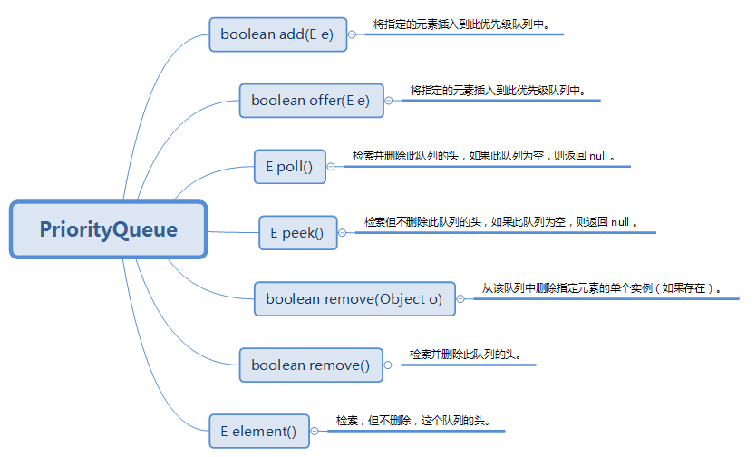

### 创建数组

#### C++

```cpp
int nums[n];
memset(nums,0,sizeof nums);
```

#### Go

```GO
nums := make([]int,n)
```

#### java

```java
int [] nums = new int[n];
```


### 求数组最大值

#### C++

```cpp
// 如果是vector<int> nums;
int mx = *max_emement(nums.begin(),nums.end());
```

#### Go

```GO
// 返回数组中最大值及其下标
func max_element(nums []int) (val,idx int){
	val = nums[0]
	idx = 0
	for i,v := range nums{
		if v > val {
			val = v
			idx = i
		}
	}
	return 
}
```

#### java

```java
int ans = Arrays.stream(nums).max().getAsInt();
```


### 自定义排序

#### C++

```cpp
// 方法1：Lambda表达式  
vector<vector<int>> arrs;
//[]表示需要作用域的哪些参数传入，这里为空，表示不需要传入任何参数，常见的有=和&
sort(arrs.begin(),arrs.end(),[](const vector<int> &A,const vector<int> & B){
    return A[1] - B[1]; // 根据arrs[i][1] 降序排序
});

// 方法2：函数方法
typedef struct
{
	int x;
	int y;
} point;
//从小到大排序，以x为主序，y为次序
bool cmp(point &a, point &b)
{
	if (a.x == b.x)
	{
		return a.y < b.y;
	}
	return a.x < b.x;
}

point p[10];
sort(p, p + 10, cmp);
```

#### Go

```GO
//1. 排序整数、浮点数和字符串切片
/*
对于 []int, []float, []string 这种元素类型是基础类型的切片使用 sort 包提供的下面几个函数进行排序。

sort.Ints
sort.Floats
sort.Strings
*/
s := []int{4, 2, 3, 1}
sort.Ints(s)
fmt.Println(s) // 输出[1 2 3 4]


//2. 自定义比较器排序
a := []int{5, 3, 4, 7, 8, 9}
sort.Slice(a, func(i, j int) bool { // 升序排序
    return a[i] < a[j]   
})
/*
使用 sort.Slice 函数排序,使用一个用户提供的函数来对序列进行排序，函数类型为 func(i, j int) bool,i, j 是序列中的索引
*/
family := []struct {
    Name string
    Age  int
}{
    {"Alice", 23},
    {"David", 2},
    {"Eve", 2},
    {"Bob", 25},
}
 //下面实现排序order by age asc, name desc，如果 age 和 name 都相等则保持原始排序
sort.SliceStable(family, func(i, j int) bool {
    if family[i].Age != family[j].Age {
        return family[i].Age < family[j].Age
    }
    return strings.Compare(family[i].Name, family[j].Name) == 1
})


```

#### java

```java
int [][] arr = new int[4][3];
Arrays.sort(boxTypes,(a,b)-> (b[1] - a[1]));

Arrays.sort(arrs, new Comparator<int[]>() {
    @Override
    public int compare(int[] o1, int[] o2) {
        return o1[0] - o2[0];
    }
});
```


### 创建数组

#### C++

```cpp
int t[N]; // 数组
int * p = new int[N];
delete []p;

//容器
vector<int> vec(size,-1); // 容器大小为size，默认值为-1
vec.emplace_back(10);
vec.pop_back();
vec.size();
vec.clear();
vec.resize(k);
```


#### GO

```go
c := make([]int, 3, 10)
// 添加元素--在尾部添加
c = append(c, 10)
c = append(c, 21, -1, 2)
c = append(c, []int{1, 2, 3, 4}...) // 追加切片，切片需要解包
// 添加元素--在头部添加
c = append([]int{-1},c...) // 在头部添加一个元素
c = append([]int{1,2,3,3},c...) // 在头部添加一个切片

// 在第i个位置添加元素 x
i := 3
x := 100
c = append(c[:i],append([]int{x},c[i:]...)...)
c = append(c[:i],append([]int{1,2,3},c[i:]...)...) // 在第i处添加切片

// 删除元素
a = []int{1,2,3}
a = a[1:]  // 删除第一个元素
a = a[N:] // 删除开头N个元素
// 删除中间一个元素
a = append(a[:i],a[i+1:]...)
// 删除中间N个元素
a = append(a[:i],a[i+N:]...)
// 删除尾部1个元素
a = a[:len(a)-1]
// 删除尾部N个元素
a = a[:len(a)-N]
```

```go
// 多维切片声明
var slice = [][]int
slice = [][]int{{10},{1,2,3}}

// 创建多维动态数组 n*m
grid := make([][]int,n)
for _,c := range grid{
  c = make([]int,m)
}
```

#### Java

```java
int [] a = new int[10];

List<Integer> list = new ArrayList<Integer>();
list.add(1);
list.remove(index);
```


### 哈希表

#### c++

``` cpp
map<string,int> m;
// 添加元素
m["abc"] = 1;
m["1111"] = 2;
// 删除元素
m.erase("abc");
// 清空
m.clear();

// 迭代遍历
for(auto & n : m){
  cout<<n.first<<" "<<n.second<<endl;
}
```


#### go

```go
map := make([string]int,10) // 10是初始容量
//遍历
for k,v := range map{
  //..
}

// 添加元素
map["12313"] = 178
// 删除元素
delete(map,"12312")
```


#### java

```java
Map<String,Integer> map = new HashMap<>();
map.put("asdad",1);
Integer t = map.getOrDefault("1231",0);
map.remove("asdad");

for (Map.Entry<Integer, Integer> entry : map.entrySet()) {
  System.out.println("Key = " + entry.getKey() + ", Value = " + entry.getValue());
}

// 迭代键
for (String key : map.keySet()) {
  System.out.println("Key = " + key);
}

// 迭代值
for (Integer value : map.values()) {
  System.out.println("Value = " + value);
}
```


### 优先级队列

#### C++

**priority_queue**：

- 模板申明带3个参数：priority_queue<Type, Container, Functional>，其中Type 为数据类型，Container为保存数据的容器，Functional 为元素比较方式。
- 比较方式默认用operator<，所以如果把后面2个参数缺省的话，优先队列就是大顶堆（降序），队头元素最大。
-  如果要用到小顶堆，则一般要把模板的3个参数都带进去。STL里面定义了一个仿函数greater<>，**基本类型可以用这个仿函数声明小顶堆**

```c++
#include<queue>

priority_queue<int> q; // 默认大顶堆，降序
priority_queue<int,vector<int>,greater<int>> q; // 小顶堆
```

- 对于自定义类型，则必须重载operator<或者重写仿函数。

  - 重载operator<的例子：返回true时，说明左边形参的优先级低于右边形参

    ```c++
    #include <iostream>
    #include <queue>
    using namespace std;
    struct Node{
        int x, y;
        Node(int a=0, int b=0):
            x(a),y(b){}
    };
    bool operator<(Node a, Node b){//返回true时，说明a的优先级低于b
        //x值较大的Node优先级低（x小的Node排在队前）
        //x相等时，y大的优先级低（y小的Node排在队前）
        if( a.x== b.x ) return a.y> b.y;
        return a.x> b.x;
    }
    int main(){
        priority_queue<Node> q;
        for( int i= 0; i< 10; ++i )
        q.push( Node( rand(), rand() ) );
        while( !q.empty() ){
            cout << q.top().x << ' ' << q.top().y << endl;
            q.pop();
        }
        return 0;
    }
    ```

  -  重写仿函数的例子

    ```c++
    #include <iostream>
    #include <queue>
    using namespace std;
    struct Node{
        int x, y;
        Node( int a= 0, int b= 0 ):
            x(a), y(b) {}
    };
    struct cmp{
        bool operator() ( Node a, Node b ){//默认是less函数
            //返回true时，a的优先级低于b的优先级（a排在b的后面）
            if( a.x== b.x ) return a.y> b.y;
            return a.x> b.x; }
    };
    int main(){
        priority_queue<Node, vector<Node>, cmp> q;
        for( int i= 0; i< 10; ++i )
        q.push( Node( rand(), rand() ) );
        while( !q.empty() ){
            cout << q.top().x << ' ' << q.top().y << endl;
            q.pop();
        }
        return 0;
    }
    ```

常用操作：

```c++
q.empty()          如果队列为空，则返回true，否则返回false

q.size()           返回队列中元素的个数

q.pop()            删除队首元素，但不返回其值

q.top()            返回具有最高优先级的元素值，但不删除该元素

q.push(item)       在基于优先级的适当位置插入新元素
```


#### GO

```go

```


#### Java

```java
class Order{ // 声明一个类
    int count;
    int val;

    public Order(int count, int val) {
        this.count = count;
        this.val = val;
    }
}
// 按照价格升序排序
Queue<Order> sell_q = new PriorityQueue<>(new Comparator<Order>() { 
    @Override
    public int compare(Order o1, Order o2) {
        return o1.val - o2.val;
    }
});
```




### 字符串与值类型转化

#### C++

```cpp
// string -> int  stoi stol stoll
string s = "12345";
int a = stoi(s);
// int -> string
string s = to_string(a);
```


#### GO

```go
a := 10
str_a := strconv.Itoa(a)
fmt.Println(str_a)

b, err := strconv.Atoi(str_a)
if err == nil {
  fmt.Println(b)
}
```


#### Java

```java
int a = Integer.parseInt(str_a);
String s = String.valueOf(a);
```


### 字符串操作


#### C++

```cpp
// 构造字符串
string str2("hello",2);//指定字符串的前2个字符
string str3(str1, 2);//从下标2开始的字符的拷贝
string str4(str1, 2,2);//从下标2开始的2个字符的拷贝
string str5(5,'a');//5个字符a
// 访问字符串
string str1("hello");
cout << str1.front() << endl;//获取string的首字符，h
cout << str1.back() << endl;//获取string的尾字符，o
cout << str1[1] << endl;//获取下标为1的字符，e
cout << str1.at(2) << endl;//获取下标为2的字符，l
cout << str1.data() << endl;//返回指向字符串首字符的指针，C++11前不一定是以空字符终止的，C++11后是空字符终止的
cout << str1.c_str() << endl;//返回指向字符串首字符的指针(空字符终止的)
cout << str1.substr(1,2) << endl;//返回从下标1开始的2个字符，el,参数1默认值为0，参数2默认值为size()-第一个参数值
cout << str1.substr() << endl;//hello
cout << str1.substr(3) << endl;//lo
cout << str1.size()<< endl;//5,size()和length()无区别，都返回字符数量
cout << str1.length() << endl;//5
// 操作字符串
string str1("hello");
string str2(" world");
auto str3 = str1 + str2;//连接两个string，hello world
auto str4 = str1 + " xiao ming";//连接string和字符指针，hello xiao ming
str3.assign("12345678");//赋值为12345678
str3.clear();//清空所有字符
str3.append("222");//追加字符串
str3.insert(1, "abc",3);
cout << str3<<endl;//2abc22
str3.replace(1, 3,"defg");
cout << str3 << endl;//2defg22
str3.erase(1, 4);
cout << str3 << endl;//222
```

查找字符串

| 操作                      | 描述                                          |
| ------------------------- | --------------------------------------------- |
| s.find(args)              | 查找s中args第一次出现的位置                   |
| s.rfind(args)             | 查找s中args最后一次出现的位置                 |
| s.find_first_of(args)     | 在s中查找args中任何一个字符第一次出现的位置   |
| s.find_last_of(args)      | 在s中查找args中任何一个字符最后一次出现的位置 |
| s.find_first_not_of(args) | 在s中查找第一个不在args中的字符               |
| s.find_last_not_of(args)  | 在s中查找最后一个不在args中的字符             |


#### GO

**strings. Contains**:检查字符串中是否包含某个字符。

```go
strings.Contains(str,"H")
```

**strings.Count**: 检查字符串中某个字符的个数。

```go
strings.Count(str,"o")
```

**strings.HasPrefix**：检查字符串中是否包含某个字符做为前缀。

```go
strings.HasPrefix(str," ")
```

**strings.HasSuffix**：检查字符串中是否包含某个字符做为后缀

```go
strings.HasSuffix(str," ")
```

**strings.Index**：字符在字符串中存在的位置

```go
strings.Index(str,"e")
```

**strings.Join**：拼接字符。

```go
strings.Join([]string{"a", "b"}, "-")  // a-b
```

**strings.Repeat**：复制几次字符串。

```go
strings.Repeat(str,2)
```

**strings.Replace**：替换字符串中的字符。

```go
strings.Replace(str,"o","i",-1)
```

**strings.Split**：指定字符分隔字符串。

```go
strings.Split("a-b-c-d-e", "-")  // [a b c d e]
```

**strings.ToLower**：将字符串转换为小写形式

```go
strings.ToLower(str)
```

**strings.ToUpper**：将字符串转换成大写形式

```go\
strings.ToUpper(str)
```

**strings.Fields**：将字符串转换成数组。

```go
strings.Fields(str)
```

**strings.TrimSpace**：去除字符串的首尾空白。

```go
strings.TrimSpace(str)
```

连接字符串的一些方法：

```go
var builder strings.Builder
builder.WriteString(str) // 拼接
builder.String() // 输出字符串
```


```go
a := 10
str_a := strconv.Itoa(a)
fmt.Println(str_a)

b, err := strconv.Atoi(str_a)
if err == nil {
  fmt.Println(b)
}
```


#### Java

```java
int a = Integer.parseInt(str_a);
String s = String.valueOf(a);
```

