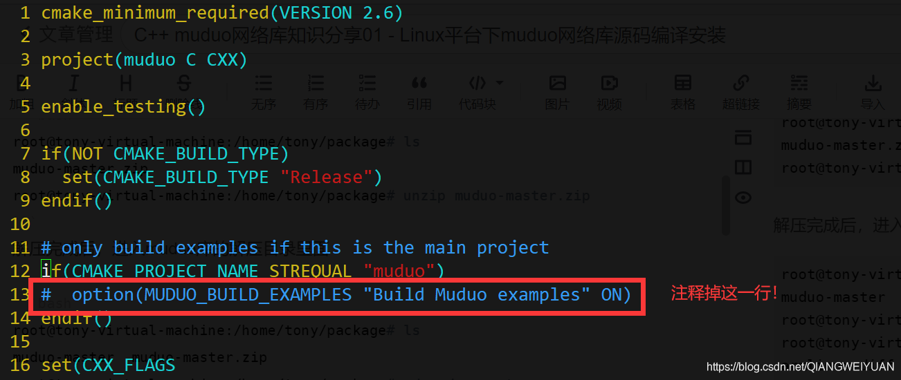

需要提前安装：cmake  boost

```
sudo apt-get install cmake
sudo apt-get install libboost-dev libboost-test-dev
```

**muduo库源码云盘下载地址**：
链接：https://pan.baidu.com/s/1Rqrnz8NY6UOiFemYQv-63Q 提取码：8nio

muduo库源码编译会编译很多unit_test测试用例代码，编译耗时长，我们也用不到，vim编辑上面源码目录里面的CMakeLists.txt文件，如下修改：



**看到有一个build.sh源码编译构建程序，运行该程序**

```shell
./build.sh
```

编译完成后安装

```
./build.sh install
```

这个./build.sh install实际上把muduo的头文件和lib库文件放到了muduo-master同级目录下的build目录下的release-install-cpp11文件夹下面了：

```
root@tony-virtual-machine:/home/tony/package# ls
build  muduo-master  muduo-master.zip
root@tony-virtual-machine:/home/tony/package# cd build/
root@tony-virtual-machine:/home/tony/package/build# ls
release-cpp11  release-install-cpp11
root@tony-virtual-machine:/home/tony/package/build# cd release-install-cpp11/
root@tony-virtual-machine:/home/tony/package/build/release-install-cpp11# ls
include  lib

```

所以上面的install命令并没有把它们拷贝到系统路径下，导致我们每次编译程序都需要指定muduo库的头文件和库文件路径，很麻烦，所以我们选择直接把inlcude（头文件）和lib（库文件）目录下的文件拷贝到系统目录下：

```
root@tony-virtual-machine:/home/tony/package/build/release-install-cpp11# ls
include  lib
root@tony-virtual-machine:/home/tony/package/build/release-install-cpp11# cd include/
root@tony-virtual-machine:/home/tony/package/build/release-install-cpp11/include# ls
muduo
root@tony-virtual-machine:/home/tony/package/build/release-install-cpp11/include# mv muduo/ /usr/include/
root@tony-virtual-machine:/home/tony/package/build/release-install-cpp11/include# cd ..
root@tony-virtual-machine:/home/tony/package/build/release-install-cpp11# ls
include  lib
root@tony-virtual-machine:/home/tony/package/build/release-install-cpp11# cd lib/
root@tony-virtual-machine:/home/tony/package/build/release-install-cpp11/lib# ls
libmuduo_base.a  libmuduo_http.a  libmuduo_inspect.a  libmuduo_net.a
root@tony-virtual-machine:/home/tony/package/build/release-install-cpp11/lib# mv * /usr/local/lib/
root@tony-virtual-machine:/home/tony/package/build/release-install-cpp11/lib# 
```

拷贝完成以后使用muduo库编写C++网络程序，不用在指定头文件和lib库文件路径信息了，因为g++会自动从/usr/include和/usr/local/lib路径下寻找所需要的文件。